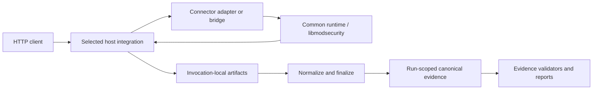

# ModSecurity Connector

**Sprache:** [English](README.md) | Deutsch

Dieses Repository enthält die repository-eigenen Integrationsschichten, die
[libmodsecurity](https://github.com/owasp-modsecurity/ModSecurity) mit sechs
HTTP-Hostfamilien verbinden: Apache, NGINX, HAProxy, Envoy, Traefik und
lighttpd. Es enthält außerdem gemeinsame Runtime-Verträge, hostspezifische
Adapter, Build-/Runtime-Orchestrierung, Konfigurationsbeispiele,
Validierungscode und Consumer für laufbezogene Evidence. Wiederverwendbare
Testfälle, Schemas und Framework-Runner liegen im Submodule
`modules/ModSecurity-test-Framework`.

Die ausgewählte Kerndokumentation konzentriert sich auf HTTP/1.1. Vorhandener
Source, erfolgreiche Builds, das Laden von Konfigurationen,
Capability-Deklarationen oder Smoke-Tests begründen für sich allein **keine**
Production Readiness und kein verifiziertes Runtime-Ergebnis. Runtime-Aussagen
sind an das ausgewählte Profil, Rules, die Run-ID, Artefakte und das
Validierungsergebnis gebunden.

## Inhalt dieses Repositorys

| Pfad | Zweck |
| --- | --- |
| `common/` | Connector-neutrale C-first-Verträge, gemeinsame Runtime-Unterstützung, Body-/Phasen-Policy und gemeinsame Mapping-Helper. |
| `connectors/` | Hostspezifische Implementierungen, Metadaten, Capability-Deklarationen, Harnesses, Provenienz und lokale Design-Notizen. |
| `docs/` | Kanonische Dokumentation zu Architektur, Konfiguration, Build, Connectoren, Tests/Evidence, Betrieb und Sicherheit. |
| `examples/` | Quellenbasierte Konfigurationsbeispiele und profilspezifische Nutzungshinweise für alle sechs Hostfamilien. |
| `ci/` und `tests/` | Statische Verträge, Lifecycle-Orchestrierung, Evidence-Prüfungen, Regressionstests und CI-Unterstützung. |
| `reports/` | Aktuelles und historisches Audit-/Testmaterial sowie generierte oder manuell gepflegte Evidence-Sichten. |
| `modules/ModSecurity-test-Framework/` | Git-Submodule mit wiederverwendbaren Cases, Schemas, Runnern, Normalizern und Test-Framework-Logik. |
| `Makefile` | Verbindlicher Root-Einstiegspunkt für Build-, Validierungs-, Runtime- und Evidence-Targetnamen des Repositorys. |

Der aktuelle Checkout ist die Source of Truth. Insbesondere stammen Targetnamen
aus dem Root-`Makefile`, Toolchain-Versionen aus den eingecheckten Dateien
`.python-version` und `.go-version`, und Connector-Verhalten aus der aktuellen
Implementierung zusammen mit ihren versionierten Verträgen.

## Unterstützte Hostfamilien und logische Profile

Das Repository hat sechs Hostfamilien, aber zehn logische Connector-Profile.
Profile derselben Hostfamilie bleiben getrennte Evidence-Scopes.

| Hostfamilie | Ausgewählte Core-Route der Hostfamilie | Logische Profile | Aktuelle Routengrenze |
| --- | --- | --- | --- |
| Apache | `native-httpd-module` | `apache` | Direkte native httpd-Modulintegration. |
| NGINX | `native-nginx-http-module` | `nginx` | Direkte native NGINX-HTTP-Modulintegration. |
| HAProxy | `native-htx-filter` | `haproxy-htx`, `haproxy-spoe-spop` | Native HTX ist direkt; SPOE/SPOP benötigt für Response-Phasen seinen Response-Companion. |
| Envoy | `ext_proc` | `envoy-ext-proc`, `envoy-ext-authz` | `ext_proc` ist direkt; `ext_authz` benötigt für Response-Phasen seinen Response-Observer. |
| Traefik | `native-traefik-middleware` | `traefik-native-uds`, `traefik-forwardauth` | Native UDS-Middleware ist direkt; `forwardAuth` benötigt für Response-Phasen seinen Response-Observer. |
| lighttpd | `patched-native-lighttpd` | `lighttpd-patched`, `lighttpd-stock` | Patched-Native- und Stock-Sidecar-Routen sind getrennte logische Profile und keine gegenseitigen Fallbacks. |

Die [Connector-Dokumentation](docs/connectors/README.de.md) enthält das
vollständige Profilinventar, die Terminologie der Integrationsmodi,
hostspezifische Variablen und bekannte Grenzen.

## ModSecurity-Phasen und Phase-4-Modi

Der gemeinsame Lifecycle verwendet das übliche ModSecurity-Phasenmodell:

| Phase | Bedeutung im Repository |
| --- | --- |
| P1 | Request-Header |
| P2 | Request-Body |
| P3 | Response-Header |
| P4 | Response-Body |

Für Phase 4 gibt es zusätzlich eine Connector-eigene Policy für ein kumulatives
Inspection-Budget. Aktuell gelten diese Modi:

| Modus | Zusätzliches kumulatives Phase-4-Budget | Grenze |
| --- | --- | --- |
| `off` (Standard) | Wird nicht durchgesetzt | Konfigurierte Engine-Inspection und native Interventions-/Fehlerbehandlung laufen weiter; unabhängige Engine-, Speicher-, Transport- und Allokationslimits gelten weiterhin. |
| `safe` | Wird durchgesetzt | Behält frühe Durchsetzung und unterstütztes `log_only`-Verhalten für späte Regeln bei. |
| `strict` | Wird durchgesetzt | Behält frühe Durchsetzung und unterstütztes Late-Abort-Verhalten bei. |

`off` deaktiviert **nicht** die Response-Body-Inspection von libmodsecurity.
Ungültige oder nicht gesetzte Moduswerte sind keine Aliase für `off`. Der
detaillierte connectorübergreifende Vertrag steht unter
[Phase-4-Modus und kumulative Inspection-Budgets](docs/phase4-mode-budget.de.md).

## Architektur



Die Hostintegration bestimmt, welche Request-/Response-Daten sichtbar sind und
an welcher Stelle eine Entscheidung noch client-sichtbares Verhalten
beeinflussen kann. Rohe Prozessausgabe ist nicht automatisch kanonische
Evidence; Finalisierung und Validierung binden Artefakte an Connector, Profil,
Rules, Konfiguration und Run-ID.

## Schnellstart

Mit Framework-Submodule klonen und die repository-orientierte Validierung
ausführen:

```sh
git clone --recurse-submodules https://github.com/Easton97-Jens/ModSecurity-conector.git
cd ModSecurity-conector
make check-framework
make quick-check
```

Wurde das Repository ohne Submodules geklont, führen Sie vor
`make check-framework` zuerst `git submodule update --init --recursive` aus.

`make quick-check` validiert Repository-Verträge, Dokumentation und ausgewählte
Strukturprüfungen. Es baut nicht jeden Host, sendet nicht durch jeden Connector
Traffic und erzeugt keine kanonische Lifecycle-Evidence.

## Häufige Workflows

| Ziel | Einstieg | Ergebnisgrenze |
| --- | --- | --- |
| Checkout validieren | `make quick-check` | Nur Repository-/Dokumentations-/Contract-Prüfung. |
| Breiteren lokalen Lint-Vertrag ausführen | `make lint` | Statische/Source-/Dokumentationsvalidierung; keine vollständige Runtime-Evidence. |
| Eine Hostroute bauen | `make build-nginx` | Nur Build-Ausgabe. |
| Eine Hostkonfiguration validieren | `make check-config-nginx` | Nur Config-Load-Ergebnis; kein Request-/Response-Proof. |
| Einen fokussierten Runtime-Smoke ausführen | `make runtime-smoke-nginx` soweit vorhanden | Enger Smoke-Nachweis; keine Full-Lifecycle-Promotion. |
| Einen ausgewählten Lifecycle ausführen | `NO_CRS_RUN_ID="core-example" make full-lifecycle-nginx` | Laufbezogene Candidate-Artefakte für diesen Connector/dieses Profil. |
| Alle sechs ausgewählten Hostfamilien-Core-Routen ausführen | `NO_CRS_RUN_ID="core-example" make full-lifecycle-all-connectors` | Aggregierter Candidate-Run; generierte Evidence prüfen und validieren. |
| Den ausgewählten Six-Connector-Core validieren | `NO_CRS_RUN_ID="core-example" make check-six-connector-core-completion` | Read-only-Evidence-Gate nur für diesen Run. |
| EN/DE-Dokumentationspaarung prüfen | `make check-bilingual-docs` | Nur Dokumentations-Paritäts-/Strukturvertrag. |

Für einen frischen Aggregate-Run eine dateisystemsichere, nicht geheime Run-ID
verwenden:

```sh
run_id="core-$(date -u +%Y%m%dT%H%M%SZ)"
NO_CRS_RUN_ID="$run_id" make full-lifecycle-all-connectors
NO_CRS_RUN_ID="$run_id" make check-six-connector-core-completion
```

Exakte Target-Voraussetzungen, Exit-Status-Semantik, Ausgabepfade und
connectorbezogene Build-Details stehen im [Build-Guide](docs/build/README.de.md)
und im [Test-/Evidence-Guide](docs/testing-and-evidence.de.md).

## Konfiguration, Pfade und Beispiele

Bevorzugen Sie Root-Targets gegenüber dem direkten Aufruf von
Connector-Harnesses. Die Root-Targets setzen kompatible aufruflokale Werte und
halten generierten Zustand außerhalb des Source-Baums.

Wichtige Variablen sind zentral unter
[Variablen und Platzhalter](docs/reference/variables.de.md) dokumentiert:

- `FRAMEWORK_ROOT` wählt den vertrauenswürdigen Framework-Checkout und verwendet
  standardmäßig `modules/ModSecurity-test-Framework`.
- `BUILD_ROOT` wählt generierte Build-/Runtime-Arbeit; ein Override sollte ein
  absoluter beschreibbarer Pfad außerhalb des Checkouts sein.
- `EVIDENCE_ROOT` wählt den externen Evidence-Baum für Evidence-erzeugende und
  Evidence-validierende Abläufe.
- `NO_CRS_RUN_ID` identifiziert ein Evidence-Set und muss ein
  dateisystemsicheres, nicht geheimes Token sein.

Vollständige quellenbasierte Hostbeispiele liegen unter
[examples/](examples/README.de.md). Der zentrale
[Konfigurations-Guide](docs/configuration.de.md) erklärt gemeinsame Konzepte und
verlinkt auf die jeweilige Connector-Syntax.

Credentials, Cookies, private Schlüssel, Request-/Response-Bodies,
personenbezogene Daten oder andere sensible Werte gehören nicht in Run-IDs,
Befehlszeilen, eingecheckte Konfiguration, Logs oder für Reviews vorgesehene
Evidence.

## Evidence und Ergebnisinterpretation

Repository-Statuswörter wie `PASS`, `FAIL`, `BLOCKED`, `NOT EXECUTED`,
`NOT APPLICABLE` und `UNSUPPORTED` sind abgegrenzte Begriffe aus dem
[Test-/Evidence-Vertrag](docs/testing-and-evidence.de.md). Eine Capability kann
implementiert sein, ohne dass ein aktueller kanonischer Run sie beweist, und
ein erfolgreicher Run erweitert den Scope nicht über sein ausgewähltes Profil,
Rules, Protokoll und seine Artefakte hinaus.

Vor einer aktuellen Ergebnisaussage sind die relevanten laufbezogenen Evidence
und [Reports](reports/README.de.md) zu prüfen. Diese README behauptet nicht:

- Production Readiness oder Production Hardening;
- CRS-Verifikation oder CRS-Vollständigkeit;
- vollständige HTTP/2- oder HTTP/3-Verifikation;
- eine vollständige Connector-/Protokoll-/Testmatrix; oder
- Strict-Late-Intervention-Verifikation für jedes Connector-Profil.

## Entwicklungs- und Dokumentationsregeln

Englisch ist die technische Primärsprache für repository-eigene Dokumentation;
deutsche Begleitdateien enthalten dieselben technischen Fakten. Befehle, Pfade,
Bezeichner, Konfigurationsschlüssel, Hashes und andere technische Literale
bleiben zwischen Sprachbegleitdateien unverändert.

Für nicht triviale Änderungen gilt die
[Change-Traceability-Policy](docs/change-traceability.de.md) und das
Pull-Request-Template. Generierte Dokumentation und Reports müssen über ihren
Source-/Generator-Vertrag geändert werden statt isoliert manuell editiert zu
werden.

Das Parent-Repository besitzt Connector-Produkt-Source, gemeinsame
Runtime-Integration, Build-/Runtime-Orchestrierung und Parent-Evidence-Consumer.
Wiederverwendbare Case-Kataloge, Schemas, Runner und Normalizer gehören in das
Submodule `modules/ModSecurity-test-Framework`.

## Sicherheit

Lesen Sie [SECURITY.de.md](SECURITY.de.md) für die Meldung von Schwachstellen
und [Betrieb und Sicherheit](docs/operations-and-security.de.md) für Runtime-,
Privacy-, Provenienz- und Deployment-Grenzen.

Dokumentation, statische Prüfungen, Builds und Config-Loads sind keine
Security-Zertifizierungen. Secrets und sensible Traffic-Daten gehören nicht in
versionierte Dateien und Review-Artefakte; Host-Exposition, Privilegien,
Dateisystemrechte, Sockets, Ports und Evidence-Aufbewahrung sind
deploymentspezifische Sicherheitsentscheidungen.

## Dokumentationsübersicht

| Bedarf | Kanonisches Dokument |
| --- | --- |
| Erster Checkout | [Einstieg](docs/getting-started.de.md) |
| Repository-Architektur | [Architektur](docs/architecture.de.md) |
| Connector-/Profilauswahl | [Connector-Index](docs/connectors/README.de.md) |
| Konfiguration | [Konfiguration](docs/configuration.de.md) |
| Variablen und Platzhalter | [Variablen](docs/reference/variables.de.md) |
| Build und Hostvorbereitung | [Build](docs/build/README.de.md) |
| Tests, Status und Evidence | [Tests und Nachweise](docs/testing-and-evidence.de.md) |
| Betrieb und Sicherheit | [Betrieb und Sicherheit](docs/operations-and-security.de.md) |
| Phase-4-Budget-Semantik | [Phase-4-Modus und Budget](docs/phase4-mode-budget.de.md) |
| Änderungsworkflow | [Nachvollziehbarkeit](docs/change-traceability.de.md) |
| Aktuelle/historische Reports | [Reports](reports/README.de.md) |
| Framework-eigene Tests | [ModSecurity-Test-Framework](modules/ModSecurity-test-Framework/README.de.md) |

## Lizenz und Provenienz

Das Verzeichnis [licenses/](licenses/README.de.md) dokumentiert die externe
Herkunft und die beobachtete Upstream-Lizenzbasis für ausgewähltes importiertes,
abgeleitetes oder als Referenz genutztes Material. Es ist keine
repository-weite Lizenzdeklaration.

Lokale Connector-Bäume können durch repository-lokale Anpassungen und
zusätzliche Source-Provenienz vom jeweiligen Upstream abweichen. Für die
dateibezogene Source-Basis sind die passenden `ORIGIN.md`- /
`SOURCE_MAP.json`-Dateien maßgeblich. Auf diesem Stand gibt es keine
Top-Level-Datei `LICENSE` im Repository.
