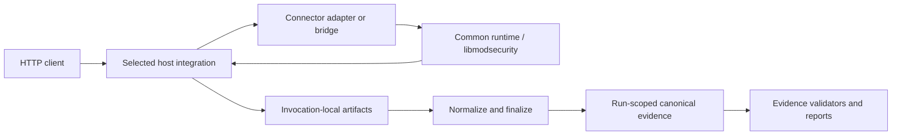

# ModSecurity Connector

**Language:** English | [Deutsch](README.de.md)

This repository contains the repository-owned integration layers that connect
[libmodsecurity](https://github.com/owasp-modsecurity/ModSecurity) to six HTTP
host families: Apache, NGINX, HAProxy, Envoy, Traefik, and lighttpd. It also
contains shared runtime contracts, host-specific adapters, build/runtime
orchestration, configuration examples, validation code, and run-scoped
evidence consumers. Reusable test cases, schemas, and framework runners live in
the `modules/ModSecurity-test-Framework` submodule.

The selected core documentation is centered on HTTP/1.1. Source presence,
successful builds, configuration loading, capability declarations, or smoke
tests do **not** by themselves establish production readiness or a verified
runtime outcome. Runtime claims are bound to the selected profile, rules,
run ID, artifacts, and validation result.

## What is in this repository

| Path | Purpose |
| --- | --- |
| `common/` | Connector-neutral C-first contracts, shared runtime support, body/phase policy, and common mapping helpers. |
| `connectors/` | Host-specific implementations, metadata, capability declarations, harnesses, provenance, and local design notes. |
| `docs/` | Canonical architecture, configuration, build, connector, testing/evidence, operations, and security documentation. |
| `examples/` | Source-backed configuration examples and profile-specific usage notes for all six host families. |
| `ci/` and `tests/` | Static contracts, lifecycle orchestration, evidence checks, regression tests, and CI support. |
| `reports/` | Current and historical audit/testing material plus generated or manually maintained evidence views. |
| `modules/ModSecurity-test-Framework/` | Git submodule containing reusable cases, schemas, runners, normalizers, and test-framework logic. |
| `Makefile` | Authoritative root entry point for repository build, validation, runtime, and evidence target names. |

Use the current checkout as the source of truth. In particular, target names
come from the root `Makefile`, toolchain versions come from the checked-in
`.python-version` and `.go-version` files, and connector behavior comes from
the current implementation plus its versioned contracts.

## Supported host families and logical profiles

The repository has six host families but ten logical connector profiles.
Profiles within the same host family remain separate evidence scopes.

| Host family | Selected host-family core route | Logical profiles | Current route boundary |
| --- | --- | --- | --- |
| Apache | `native-httpd-module` | `apache` | Direct native httpd module integration. |
| NGINX | `native-nginx-http-module` | `nginx` | Direct native NGINX HTTP module integration. |
| HAProxy | `native-htx-filter` | `haproxy-htx`, `haproxy-spoe-spop` | Native HTX is direct; SPOE/SPOP requires its response companion for response phases. |
| Envoy | `ext_proc` | `envoy-ext-proc`, `envoy-ext-authz` | `ext_proc` is direct; `ext_authz` requires its response observer for response phases. |
| Traefik | `native-traefik-middleware` | `traefik-native-uds`, `traefik-forwardauth` | Native UDS middleware is direct; `forwardAuth` requires its response observer for response phases. |
| lighttpd | `patched-native-lighttpd` | `lighttpd-patched`, `lighttpd-stock` | Patched-native and Stock-sidecar routes are separate logical profiles, not fallbacks for one another. |

See the [connector documentation](docs/connectors/README.md) for the complete
profile inventory, integration-mode terminology, host-specific variables, and
known boundaries.

## ModSecurity phases and Phase-4 modes

The shared lifecycle uses the usual ModSecurity phase model:

| Phase | Repository meaning |
| --- | --- |
| P1 | Request headers |
| P2 | Request body |
| P3 | Response headers |
| P4 | Response body |

Phase 4 has an additional connector-owned cumulative inspection-budget policy.
The current modes are:

| Mode | Extra cumulative Phase-4 budget | Boundary |
| --- | --- | --- |
| `off` (default) | Not enforced | Configured engine inspection and native intervention/error handling continue; independent engine, memory, transport, and allocation limits still apply. |
| `safe` | Enforced | Preserves early enforcement and supported late-rule `log_only` behavior. |
| `strict` | Enforced | Preserves early enforcement and supported late-abort behavior. |

`off` does **not** disable libmodsecurity response-body inspection. Invalid or
unset mode values are not aliases for `off`. The detailed cross-connector
contract is documented in [Phase-4 mode and cumulative inspection budgets](docs/phase4-mode-budget.md).

## Architecture



The host integration determines which request/response data is visible and
where a decision can still affect client-visible behavior. Raw process output is
not automatically canonical evidence; finalization and validation bind
artifacts to the connector, profile, rules, configuration, and run ID.

## Quick start

Clone with the Framework submodule and run the repository-oriented validation:

```sh
git clone --recurse-submodules https://github.com/Easton97-Jens/ModSecurity-conector.git
cd ModSecurity-conector
make check-framework
make quick-check
```

If the repository was cloned without submodules, initialize them with
`git submodule update --init --recursive` before running `make check-framework`.

`make quick-check` validates repository contracts, documentation, and selected
structural checks. It does not build every host, send traffic through every
connector, or create canonical lifecycle evidence.

## Common workflows

| Goal | Start with | Result boundary |
| --- | --- | --- |
| Validate the checkout | `make quick-check` | Repository/documentation/contracts only. |
| Run the broader local lint contract | `make lint` | Static/source/documentation validation; not full runtime evidence. |
| Build one host route | `make build-nginx` | Build output only. |
| Validate one host configuration | `make check-config-nginx` | Configuration-load result only; no request/response proof. |
| Run a focused runtime smoke | `make runtime-smoke-nginx` where provided | Narrow smoke result; not full-lifecycle promotion. |
| Run one selected lifecycle | `NO_CRS_RUN_ID="core-example" make full-lifecycle-nginx` | Run-scoped candidate artifacts for that connector/profile. |
| Run all six selected host-family core routes | `NO_CRS_RUN_ID="core-example" make full-lifecycle-all-connectors` | Aggregate candidate run; inspect and validate the generated evidence. |
| Validate the selected six-connector core | `NO_CRS_RUN_ID="core-example" make check-six-connector-core-completion` | Read-only evidence gate for that run only. |
| Check EN/DE documentation pairing | `make check-bilingual-docs` | Documentation parity/structure contract only. |

For a fresh aggregate run, use a filesystem-safe, non-secret run ID:

```sh
run_id="core-$(date -u +%Y%m%dT%H%M%SZ)"
NO_CRS_RUN_ID="$run_id" make full-lifecycle-all-connectors
NO_CRS_RUN_ID="$run_id" make check-six-connector-core-completion
```

Exact target prerequisites, exit-status semantics, output locations, and
per-connector build details are documented in the [build guide](docs/build/README.md)
and [testing/evidence guide](docs/testing-and-evidence.md).

## Configuration, paths, and examples

Prefer root targets over invoking connector harnesses directly. The root
targets set compatible invocation-local values and keep generated state outside
the source tree.

Key variables are documented centrally in
[Variables and placeholders](docs/reference/variables.md):

- `FRAMEWORK_ROOT` selects the trusted Framework checkout and defaults to
  `modules/ModSecurity-test-Framework`.
- `BUILD_ROOT` selects generated build/runtime work; an override should be an
  absolute writable path outside the checkout.
- `EVIDENCE_ROOT` selects the external evidence tree used by evidence-producing
  and evidence-validating flows.
- `NO_CRS_RUN_ID` identifies one evidence set and must be a filesystem-safe,
  non-secret token.

Complete source-backed host examples live under [examples/](examples/README.md).
The central [configuration guide](docs/configuration.md) explains shared
concepts and links to the per-connector syntax.

Do not put credentials, cookies, private keys, request/response bodies, personal
data, or other sensitive values in run IDs, command lines, checked-in
configuration, logs, or evidence intended for review.

## Evidence and result interpretation

Repository status words such as `PASS`, `FAIL`, `BLOCKED`, `NOT EXECUTED`,
`NOT APPLICABLE` , and `UNSUPPORTED` are scoped terms defined by the
[testing/evidence contract](docs/testing-and-evidence.md). A capability may be
implemented without a current canonical run proving it, and a successful run
does not widen the scope beyond its selected profile, rules, protocol, and
artifacts.

Before making a current result claim, review the relevant run-scoped evidence
and [reports](reports/README.md). This README does not claim:

- production readiness or production hardening;
- CRS verification or CRS completeness;
- complete HTTP/2 or HTTP/3 verification;
- a complete connector/protocol/test matrix; or
- strict late-intervention verification for every connector profile.

## Development and documentation rules

English is the technical primary language for repository-owned documentation;
German companion files carry equivalent technical facts. Keep commands, paths,
identifiers, configuration keys, hashes, and other technical literals unchanged
between language companions.

For non-trivial changes, follow the repository's
[change-traceability policy](docs/change-traceability.md) and the pull-request
template. Generated documentation and reports must be changed through their
source/generator contract instead of being hand-edited in isolation.

The Parent repository owns connector product source, shared runtime integration,
build/runtime orchestration, and Parent evidence consumers. Reusable case
catalogs, schemas, runners, and normalizers belong to the
`modules/ModSecurity-test-Framework` submodule.

## Security

Read [SECURITY.md](SECURITY.md) for vulnerability reporting and
[Operations and security](docs/operations-and-security.md) for runtime,
privacy, provenance, and deployment boundaries.

Documentation, static checks, builds, and configuration loads are not security
certifications. Keep secrets and sensitive traffic data out of versioned files
and review artifacts, and treat host exposure, privileges, filesystem
permissions, sockets, ports, and evidence retention as deployment-specific
security decisions.

## Documentation map

| Need | Canonical document |
| --- | --- |
| First checkout | [Getting started](docs/getting-started.md) |
| Repository architecture | [Architecture](docs/architecture.md) |
| Connector/profile selection | [Connector index](docs/connectors/README.md) |
| Configuration | [Configuration](docs/configuration.md) |
| Variables and placeholders | [Variables](docs/reference/variables.md) |
| Build and host preparation | [Build](docs/build/README.md) |
| Tests, status, and evidence | [Testing and evidence](docs/testing-and-evidence.md) |
| Operations and security | [Operations and security](docs/operations-and-security.md) |
| Phase-4 budget semantics | [Phase-4 mode and budget](docs/phase4-mode-budget.md) |
| Change workflow | [Change traceability](docs/change-traceability.md) |
| Current/historical reports | [Reports](reports/README.md) |
| Framework-owned testing | [ModSecurity test Framework/](modules/ModSecurity-test-Framework/README.md) |

## License and provenance

This repository contains repository-authored integration code as well as
imported or derived material with component-specific provenance. Do not infer a
single license for every file from the repository name. Review
[licenses/](licenses/README.md) and each connector's `ORIGIN.md` /
`SOURCE_MAP.json` for the applicable source, attribution, and license boundary.
