> Generated file - do not edit manually.
>
> Generated at: `2026-06-17T02:40:22Z`
> Verified run id: `2026-06-16T19-12-00Z-614c8049`
> Data source policy: `verified-inputs-only`
> Generator: `ci/refresh-connector-reports.py`
> Make target: `refresh-connector-reports`
> Owner: `manifest`
> Severity: `important`
> Connector SHA: `614c80493b6ebd25a17e1d27979071e5e30584d4`
> Framework SHA: `24509c107ecf3a22ae9d69875f661690bd6fb95b`
> Input status: `complete`

# Report Dependency Graph

## Mermaid

```mermaid
flowchart TD
  report_refresh_manifest["report-refresh-manifest.generated"]
  report_dependency_graph["report-dependency-graph.generated"]
  report_data_lineage["report-data-lineage.generated"]
  report_freshness["report-freshness.generated"]
  report_path_migration["report-path-migration.generated"]
  generator_runtime_summary["generator-runtime-summary.generated"]
  verified_run_manifest["verified-run-manifest.generated"]
  merge_readiness_dashboard["merge-readiness-dashboard.generated"]
  verified_runtime_mismatch_analysis["verified-runtime-mismatch-analysis.generated"]
  full_matrix_job_completeness["full-matrix-job-completeness.generated"]
  nginx_mrts_http500_cluster_analysis["nginx-mrts-http500-cluster-analysis.generated"]
  system_environment_proof["system-environment-proof.generated"]
  full_runtime_matrix["full-runtime-matrix.generated"]
  full_run_evidence["full-run-evidence.generated"]
  final_consistency_audit["final-consistency-audit.generated"]
  remaining_failure_analysis["remaining-failure-analysis.generated"]
  next_fix_plan["next-fix-plan.generated"]
  connector_work_queue["connector-work-queue.generated"]
  phase_work_queue["phase-work-queue.generated"]
  case_matrix["case-matrix.generated"]
  connector_gap_summary["connector-gap-summary.generated"]
  coverage_summary["coverage-summary.generated"]
  phase_coverage["phase-coverage.generated"]
  xfail_summary["xfail-summary.generated"]
  body_processor_analysis["body-processor-analysis.generated"]
  intervention_blocking_analysis["intervention-blocking-analysis.generated"]
  no_mrts_intervention_nomatch_analysis["no-mrts-intervention-nomatch-analysis.generated"]
  nolog_audit_evidence["nolog-audit-evidence.generated"]
  phase4_hard_abort_capability["phase4-hard-abort-capability.generated"]
  response_header_hook_analysis["response-header-hook-analysis.generated"]
  rule_chain_semantics_analysis["rule-chain-semantics-analysis.generated"]
  apache_runtime_results["apache-runtime-results.generated"]
  nginx_runtime_results["nginx-runtime-results.generated"]
  haproxy_runtime_results["haproxy-runtime-results.generated"]
  runtime_matrix["runtime-matrix.generated"]
  mrts_native_full["mrts-native-full.generated"]
  mrts_native_apache["mrts-native-apache.generated"]
  mrts_native_nginx["mrts-native-nginx.generated"]
  mrts_native_summary["mrts-native-summary.generated"]
  runtime_build_cache["runtime-build-cache.generated"]
  runtime_component_cache["runtime-component-cache.generated"]
  body_processor_analysis --> final_consistency_audit
  connector_work_queue --> body_processor_analysis
  connector_work_queue --> final_consistency_audit
  connector_work_queue --> full_run_evidence
  connector_work_queue --> intervention_blocking_analysis
  connector_work_queue --> next_fix_plan
  connector_work_queue --> nolog_audit_evidence
  connector_work_queue --> phase4_hard_abort_capability
  connector_work_queue --> phase_work_queue
  connector_work_queue --> remaining_failure_analysis
  connector_work_queue --> response_header_hook_analysis
  connector_work_queue --> rule_chain_semantics_analysis
  full_matrix_job_completeness --> nginx_mrts_http500_cluster_analysis
  full_run_evidence --> final_consistency_audit
  full_runtime_matrix --> connector_work_queue
  full_runtime_matrix --> final_consistency_audit
  full_runtime_matrix --> full_run_evidence
  full_runtime_matrix --> intervention_blocking_analysis
  full_runtime_matrix --> next_fix_plan
  full_runtime_matrix --> no_mrts_intervention_nomatch_analysis
  full_runtime_matrix --> nolog_audit_evidence
  full_runtime_matrix --> phase4_hard_abort_capability
  full_runtime_matrix --> phase_work_queue
  full_runtime_matrix --> remaining_failure_analysis
  full_runtime_matrix --> response_header_hook_analysis
  full_runtime_matrix --> rule_chain_semantics_analysis
  intervention_blocking_analysis --> final_consistency_audit
  intervention_blocking_analysis --> no_mrts_intervention_nomatch_analysis
  mrts_native_apache --> phase4_hard_abort_capability
  mrts_native_nginx --> phase4_hard_abort_capability
  mrts_native_summary --> final_consistency_audit
  mrts_native_summary --> full_run_evidence
  mrts_native_summary --> next_fix_plan
  mrts_native_summary --> remaining_failure_analysis
  next_fix_plan --> body_processor_analysis
  next_fix_plan --> final_consistency_audit
  next_fix_plan --> intervention_blocking_analysis
  next_fix_plan --> no_mrts_intervention_nomatch_analysis
  next_fix_plan --> rule_chain_semantics_analysis
  no_mrts_intervention_nomatch_analysis --> final_consistency_audit
  nolog_audit_evidence --> final_consistency_audit
  phase4_hard_abort_capability --> final_consistency_audit
  phase_coverage --> nolog_audit_evidence
  phase_coverage --> phase_work_queue
  phase_coverage --> response_header_hook_analysis
  phase_work_queue --> body_processor_analysis
  phase_work_queue --> final_consistency_audit
  phase_work_queue --> full_run_evidence
  phase_work_queue --> intervention_blocking_analysis
  phase_work_queue --> next_fix_plan
  phase_work_queue --> remaining_failure_analysis
  remaining_failure_analysis --> body_processor_analysis
  remaining_failure_analysis --> final_consistency_audit
  remaining_failure_analysis --> intervention_blocking_analysis
  remaining_failure_analysis --> no_mrts_intervention_nomatch_analysis
  remaining_failure_analysis --> rule_chain_semantics_analysis
  response_header_hook_analysis --> final_consistency_audit
  rule_chain_semantics_analysis --> final_consistency_audit
  runtime_build_cache --> runtime_component_cache
  runtime_component_cache --> runtime_build_cache
  verified_runtime_mismatch_analysis --> nginx_mrts_http500_cluster_analysis
```

## Reports

| Report | Inputs | Outputs | Dependencies |
|---|---|---|---|
| `report_refresh_manifest` | - | `reports/testing/generated/manifest/report-refresh-manifest.generated.json` `reports/testing/generated/manifest/report-refresh-manifest.generated.md` | - |
| `report_dependency_graph` | - | `reports/testing/generated/manifest/report-dependency-graph.generated.json` `reports/testing/generated/manifest/report-dependency-graph.generated.md` | - |
| `report_data_lineage` | - | `reports/testing/generated/manifest/report-data-lineage.generated.json` `reports/testing/generated/manifest/report-data-lineage.generated.md` | - |
| `report_freshness` | - | `reports/testing/generated/manifest/report-freshness.generated.json` `reports/testing/generated/manifest/report-freshness.generated.md` | - |
| `report_path_migration` | - | `reports/testing/generated/manifest/report-path-migration.generated.json` `reports/testing/generated/manifest/report-path-migration.generated.md` | - |
| `generator_runtime_summary` | - | `reports/testing/generated/manifest/generator-runtime-summary.generated.md` | - |
| `verified_run_manifest` | - | `reports/testing/generated/manifest/verified-run-manifest.generated.json` `reports/testing/generated/manifest/verified-run-manifest.generated.md` | - |
| `merge_readiness_dashboard` | - | `reports/testing/generated/manifest/merge-readiness-dashboard.generated.json` `reports/testing/generated/manifest/merge-readiness-dashboard.generated.md` | - |
| `verified_runtime_mismatch_analysis` | `/var/tmp/ModSecurity-conector-verified/build/verified-runs/2026-06-16T19-12-00Z-614c8049/verified-commands.json` `/var/tmp/ModSecurity-conector-verified/build/full-matrix/full-runtime-matrix-runs.jsonl` | `reports/testing/generated/manifest/verified-runtime-mismatch-analysis.generated.json` `reports/testing/generated/manifest/verified-runtime-mismatch-analysis.generated.md` | - |
| `full_matrix_job_completeness` | `/var/tmp/ModSecurity-conector-verified/build/verified-runs/2026-06-16T19-12-00Z-614c8049/verified-commands.json` `/var/tmp/ModSecurity-conector-verified/build/full-matrix/full-runtime-matrix-runs.jsonl` | `reports/testing/generated/manifest/full-matrix-job-completeness.generated.json` `reports/testing/generated/manifest/full-matrix-job-completeness.generated.md` | - |
| `nginx_mrts_http500_cluster_analysis` | `/var/tmp/ModSecurity-conector-verified/build/verified-runs/2026-06-16T19-12-00Z-614c8049/verified-commands.json` `/var/tmp/ModSecurity-conector-verified/build/full-matrix/full-runtime-matrix-runs.jsonl` `reports/testing/generated/manifest/full-matrix-job-completeness.generated.json` `reports/testing/generated/manifest/verified-runtime-mismatch-analysis.generated.json` | `reports/testing/generated/manifest/nginx-mrts-http500-cluster-analysis.generated.json` `reports/testing/generated/manifest/nginx-mrts-http500-cluster-analysis.generated.md` | `full_matrix_job_completeness`, `verified_runtime_mismatch_analysis` |
| `system_environment_proof` | - | `reports/testing/generated/manifest/system-environment-proof.generated.json` `reports/testing/generated/manifest/system-environment-proof.generated.md` | - |
| `full_runtime_matrix` | `/var/tmp/ModSecurity-conector-verified/build/full-matrix/full-runtime-matrix-runs.jsonl` | `reports/testing/generated/canonical/full-runtime-matrix.generated.json` `reports/testing/generated/canonical/full-runtime-matrix.generated.md` | - |
| `full_run_evidence` | `reports/testing/generated/canonical/full-runtime-matrix.generated.json` `reports/testing/generated/work-queues/connector-work-queue.generated.json` `reports/testing/generated/work-queues/phase-work-queue.generated.json` `reports/testing/generated/mrts-native/mrts-native-summary.generated.json` | `reports/testing/generated/canonical/full-run-evidence.generated.json` `reports/testing/generated/canonical/full-run-evidence.generated.md` | `connector_work_queue`, `full_runtime_matrix`, `mrts_native_summary`, `phase_work_queue` |
| `final_consistency_audit` | `reports/testing/generated/canonical/full-runtime-matrix.generated.json` `reports/testing/generated/work-queues/connector-work-queue.generated.json` `reports/testing/generated/work-queues/phase-work-queue.generated.json` `reports/testing/generated/canonical/remaining-failure-analysis.generated.json` `reports/testing/generated/canonical/next-fix-plan.generated.json` `reports/testing/generated/canonical/full-run-evidence.generated.json` `reports/testing/generated/mrts-native/mrts-native-summary.generated.json` `reports/testing/generated/focused-analysis/phase4-hard-abort-capability.generated.json` `reports/testing/generated/focused-analysis/nolog-audit-evidence.generated.json` `reports/testing/generated/focused-analysis/response-header-hook-analysis.generated.json` `reports/testing/generated/focused-analysis/body-processor-analysis.generated.json` `reports/testing/generated/focused-analysis/intervention-blocking-analysis.generated.json` `reports/testing/generated/focused-analysis/no-mrts-intervention-nomatch-analysis.generated.json` `reports/testing/generated/focused-analysis/rule-chain-semantics-analysis.generated.json` | `reports/testing/generated/canonical/final-consistency-audit.generated.json` `reports/testing/generated/canonical/final-consistency-audit.generated.md` | `body_processor_analysis`, `connector_work_queue`, `full_run_evidence`, `full_runtime_matrix`, `intervention_blocking_analysis`, `mrts_native_summary`, `next_fix_plan`, `no_mrts_intervention_nomatch_analysis`, `nolog_audit_evidence`, `phase4_hard_abort_capability`, `phase_work_queue`, `remaining_failure_analysis`, `response_header_hook_analysis`, `rule_chain_semantics_analysis` |
| `remaining_failure_analysis` | `reports/testing/generated/canonical/full-runtime-matrix.generated.json` `reports/testing/generated/work-queues/connector-work-queue.generated.json` `reports/testing/generated/work-queues/phase-work-queue.generated.json` `reports/testing/generated/mrts-native/mrts-native-summary.generated.json` | `reports/testing/generated/canonical/remaining-failure-analysis.generated.json` `reports/testing/generated/canonical/remaining-failure-analysis.generated.md` | `connector_work_queue`, `full_runtime_matrix`, `mrts_native_summary`, `phase_work_queue` |
| `next_fix_plan` | `reports/testing/generated/canonical/full-runtime-matrix.generated.json` `reports/testing/generated/work-queues/connector-work-queue.generated.json` `reports/testing/generated/work-queues/phase-work-queue.generated.json` `reports/testing/generated/mrts-native/mrts-native-summary.generated.json` | `reports/testing/generated/canonical/next-fix-plan.generated.json` `reports/testing/generated/canonical/next-fix-plan.generated.md` | `connector_work_queue`, `full_runtime_matrix`, `mrts_native_summary`, `phase_work_queue` |
| `connector_work_queue` | `reports/testing/generated/canonical/full-runtime-matrix.generated.json` | `reports/testing/generated/work-queues/connector-work-queue.generated.json` `reports/testing/generated/work-queues/connector-work-queue.generated.md` | `full_runtime_matrix` |
| `phase_work_queue` | `reports/testing/generated/work-queues/connector-work-queue.generated.json` `reports/testing/generated/coverage/phase-coverage.generated.md` `reports/testing/generated/canonical/full-runtime-matrix.generated.json` | `reports/testing/generated/work-queues/phase-work-queue.generated.json` `reports/testing/generated/work-queues/phase-work-queue.generated.md` | `connector_work_queue`, `full_runtime_matrix`, `phase_coverage` |
| `case_matrix` | `config/testing/import-status.json` `reports/testing/runtime-validation-snapshot.json` | `reports/testing/generated/coverage/case-matrix.generated.md` | - |
| `connector_gap_summary` | `config/testing/import-status.json` `reports/testing/runtime-validation-snapshot.json` | `reports/testing/generated/coverage/connector-gap-summary.generated.md` | - |
| `coverage_summary` | `config/testing/import-status.json` `reports/testing/runtime-validation-snapshot.json` | `reports/testing/generated/coverage/coverage-summary.generated.md` | - |
| `phase_coverage` | `config/testing/import-status.json` `reports/testing/runtime-validation-snapshot.json` | `reports/testing/generated/coverage/phase-coverage.generated.md` | - |
| `xfail_summary` | `config/testing/import-status.json` `reports/testing/runtime-validation-snapshot.json` | `reports/testing/generated/coverage/xfail-summary.generated.md` | - |
| `body_processor_analysis` | `reports/testing/generated/work-queues/connector-work-queue.generated.json` `reports/testing/generated/canonical/remaining-failure-analysis.generated.json` `reports/testing/generated/work-queues/phase-work-queue.generated.json` `reports/testing/generated/canonical/next-fix-plan.generated.json` | `reports/testing/generated/focused-analysis/body-processor-analysis.generated.json` `reports/testing/generated/focused-analysis/body-processor-analysis.generated.md` | `connector_work_queue`, `next_fix_plan`, `phase_work_queue`, `remaining_failure_analysis` |
| `intervention_blocking_analysis` | `reports/testing/generated/work-queues/connector-work-queue.generated.json` `reports/testing/generated/canonical/full-runtime-matrix.generated.json` `reports/testing/generated/canonical/remaining-failure-analysis.generated.json` `reports/testing/generated/work-queues/phase-work-queue.generated.json` `reports/testing/generated/canonical/next-fix-plan.generated.json` | `reports/testing/generated/focused-analysis/intervention-blocking-analysis.generated.json` `reports/testing/generated/focused-analysis/intervention-blocking-analysis.generated.md` | `connector_work_queue`, `full_runtime_matrix`, `next_fix_plan`, `phase_work_queue`, `remaining_failure_analysis` |
| `no_mrts_intervention_nomatch_analysis` | `reports/testing/generated/focused-analysis/intervention-blocking-analysis.generated.json` `reports/testing/generated/canonical/full-runtime-matrix.generated.json` `reports/testing/generated/canonical/remaining-failure-analysis.generated.json` `reports/testing/generated/canonical/next-fix-plan.generated.json` | `reports/testing/generated/focused-analysis/no-mrts-intervention-nomatch-analysis.generated.json` `reports/testing/generated/focused-analysis/no-mrts-intervention-nomatch-analysis.generated.md` | `full_runtime_matrix`, `intervention_blocking_analysis`, `next_fix_plan`, `remaining_failure_analysis` |
| `nolog_audit_evidence` | `reports/testing/generated/work-queues/connector-work-queue.generated.json` `reports/testing/generated/canonical/full-runtime-matrix.generated.json` `reports/testing/generated/coverage/phase-coverage.generated.md` | `reports/testing/generated/focused-analysis/nolog-audit-evidence.generated.json` `reports/testing/generated/focused-analysis/nolog-audit-evidence.generated.md` | `connector_work_queue`, `full_runtime_matrix`, `phase_coverage` |
| `phase4_hard_abort_capability` | `reports/testing/generated/work-queues/connector-work-queue.generated.json` `reports/testing/generated/canonical/full-runtime-matrix.generated.json` `reports/testing/generated/mrts-native/mrts-native-apache.generated.json` `reports/testing/generated/mrts-native/mrts-native-nginx.generated.json` | `reports/testing/generated/focused-analysis/phase4-hard-abort-capability.generated.json` `reports/testing/generated/focused-analysis/phase4-hard-abort-capability.generated.md` | `connector_work_queue`, `full_runtime_matrix`, `mrts_native_apache`, `mrts_native_nginx` |
| `response_header_hook_analysis` | `reports/testing/generated/work-queues/connector-work-queue.generated.json` `reports/testing/generated/canonical/full-runtime-matrix.generated.json` `reports/testing/generated/coverage/phase-coverage.generated.md` | `reports/testing/generated/focused-analysis/response-header-hook-analysis.generated.json` `reports/testing/generated/focused-analysis/response-header-hook-analysis.generated.md` | `connector_work_queue`, `full_runtime_matrix`, `phase_coverage` |
| `rule_chain_semantics_analysis` | `reports/testing/generated/work-queues/connector-work-queue.generated.json` `reports/testing/generated/canonical/remaining-failure-analysis.generated.json` `reports/testing/generated/canonical/next-fix-plan.generated.json` `reports/testing/generated/canonical/full-runtime-matrix.generated.json` | `reports/testing/generated/focused-analysis/rule-chain-semantics-analysis.generated.json` `reports/testing/generated/focused-analysis/rule-chain-semantics-analysis.generated.md` | `connector_work_queue`, `full_runtime_matrix`, `next_fix_plan`, `remaining_failure_analysis` |
| `apache_runtime_results` | `config/testing/import-status.json` `reports/testing/runtime-validation-snapshot.json` | `reports/testing/generated/runtime/apache-runtime-results.generated.md` | - |
| `nginx_runtime_results` | `config/testing/import-status.json` `reports/testing/runtime-validation-snapshot.json` | `reports/testing/generated/runtime/nginx-runtime-results.generated.md` | - |
| `haproxy_runtime_results` | `config/testing/import-status.json` `reports/testing/runtime-validation-snapshot.json` | `reports/testing/generated/runtime/haproxy-runtime-results.generated.md` | - |
| `runtime_matrix` | `config/testing/import-status.json` `reports/testing/runtime-validation-snapshot.json` | `reports/testing/generated/runtime/runtime-matrix.generated.md` | - |
| `mrts_native_full` | `/var/tmp/ModSecurity-conector-verified/build/mrts-native/apache2_ubuntu/job.json` `/var/tmp/ModSecurity-conector-verified/build/mrts-native/nginx-pr24/job.json` | `reports/testing/generated/mrts-native/mrts-native-full.generated.json` `reports/testing/generated/mrts-native/mrts-native-full.generated.md` | - |
| `mrts_native_apache` | `/var/tmp/ModSecurity-conector-verified/build/mrts-native/apache2_ubuntu/job.json` `/var/tmp/ModSecurity-conector-verified/build/mrts-native/nginx-pr24/job.json` | `reports/testing/generated/mrts-native/mrts-native-apache.generated.json` `reports/testing/generated/mrts-native/mrts-native-apache.generated.md` | - |
| `mrts_native_nginx` | `/var/tmp/ModSecurity-conector-verified/build/mrts-native/apache2_ubuntu/job.json` `/var/tmp/ModSecurity-conector-verified/build/mrts-native/nginx-pr24/job.json` | `reports/testing/generated/mrts-native/mrts-native-nginx.generated.json` `reports/testing/generated/mrts-native/mrts-native-nginx.generated.md` | - |
| `mrts_native_summary` | `/var/tmp/ModSecurity-conector-verified/build/mrts-native/apache2_ubuntu/job.json` `/var/tmp/ModSecurity-conector-verified/build/mrts-native/nginx-pr24/job.json` | `reports/testing/generated/mrts-native/mrts-native-summary.generated.json` `reports/testing/generated/mrts-native/mrts-native-summary.generated.md` | - |
| `runtime_build_cache` | `reports/testing/generated/cache/runtime-component-cache.generated.json` `reports/testing/generated/cache/runtime-build-cache.generated.json` | `reports/testing/generated/cache/runtime-build-cache.generated.json` `reports/testing/generated/cache/runtime-build-cache.generated.md` | `runtime_component_cache` |
| `runtime_component_cache` | `reports/testing/generated/cache/runtime-component-cache.generated.json` `reports/testing/generated/cache/runtime-build-cache.generated.json` | `reports/testing/generated/cache/runtime-component-cache.generated.json` `reports/testing/generated/cache/runtime-component-cache.generated.md` | `runtime_build_cache` |

## Root Inputs

- `/var/tmp/ModSecurity-conector-verified/build/full-matrix/full-runtime-matrix-runs.jsonl`
- `/var/tmp/ModSecurity-conector-verified/build/mrts-native/apache2_ubuntu/job.json`
- `/var/tmp/ModSecurity-conector-verified/build/mrts-native/nginx-pr24/job.json`
- `/var/tmp/ModSecurity-conector-verified/build/verified-runs/2026-06-16T19-12-00Z-614c8049/verified-commands.json`
- `config/testing/import-status.json`
- `reports/testing/generated/cache/runtime-build-cache.generated.json`
- `reports/testing/generated/cache/runtime-component-cache.generated.json`
- `reports/testing/runtime-validation-snapshot.json`

## Final Reports

- `final_consistency_audit`
- `full_run_evidence`
- `merge_readiness_dashboard`

## Data Sources

| Value | Source | Source Hash | Verified Run ID | Status |
|---|---|---|---|---|
| Declared input | `/var/tmp/ModSecurity-conector-verified/build/full-matrix/full-runtime-matrix-runs.jsonl` | `d2e21234df8b14aa214920453961538724f99e195f37d247c91785db79b7db23` | `2026-06-16T19-12-00Z-614c8049` | present |
| Declared input | `/var/tmp/ModSecurity-conector-verified/build/mrts-native/apache2_ubuntu/job.json` | `234ac210219fe61948da3815ed6587a21d86497fad6ef1a2a4d67acab12f1eda` | `2026-06-16T19-12-00Z-614c8049` | present |
| Declared input | `/var/tmp/ModSecurity-conector-verified/build/mrts-native/nginx-pr24/job.json` | `161d7c17ed090bfe0cb7842c33c98251d8d217b73de5f09e8b886a5cbc0970a7` | `2026-06-16T19-12-00Z-614c8049` | present |
| Declared input | `/var/tmp/ModSecurity-conector-verified/build/verified-runs/2026-06-16T19-12-00Z-614c8049/verified-commands.json` | `cbdb375cdfd0974fcdb515076272ae2edc7a4f78fcf56e02e35c944f5d2c56c7` | `2026-06-16T19-12-00Z-614c8049` | present |
| Declared input | `config/testing/import-status.json` | `5eea82df1ded18c34bbc8cf6fc5992572edaa6723a33b6dd4a0b49ee00ab5a4f` | `2026-06-16T19-12-00Z-614c8049` | present |
| Declared input | `reports/testing/generated/cache/runtime-build-cache.generated.json` | `209214455838f98bb34f32ad8fc4c253c89fbf671db412542638a809cb748d87` | `2026-06-16T19-12-00Z-614c8049` | present |
| Declared input | `reports/testing/generated/cache/runtime-component-cache.generated.json` | `8ea0bad90117ba5fcbede1ee8cce97fffff7701297ceb490670faa4ea3c48126` | `2026-06-16T19-12-00Z-614c8049` | present |
| Declared input | `reports/testing/generated/canonical/full-run-evidence.generated.json` | `6f7c469a2eb7869d6b401cf502cf6195bd3c0efecea4f83192c051a11797dd6a` | `2026-06-16T19-12-00Z-614c8049` | present |
| Declared input | `reports/testing/generated/canonical/full-runtime-matrix.generated.json` | `676cc8d9b51b9294387e0b73fe8a7ff1f78a4fe5ff268f5996cb1967b906c576` | `2026-06-16T19-12-00Z-614c8049` | present |
| Declared input | `reports/testing/generated/canonical/next-fix-plan.generated.json` | `56d43bad850595932f10e7e412d8d7a2a63b60ec8a170535015b7eb12ad7f15d` | `2026-06-16T19-12-00Z-614c8049` | present |
| Declared input | `reports/testing/generated/canonical/remaining-failure-analysis.generated.json` | `893fb7f44572f7c5b06974f727c4bd5b56ac2b68eeaf50bd2eb287292a85c567` | `2026-06-16T19-12-00Z-614c8049` | present |
| Declared input | `reports/testing/generated/coverage/phase-coverage.generated.md` | `8e4db3774f091e7031c19862d57a29ef6291cb2e82469d9626d637869726c1e4` | `2026-06-16T19-12-00Z-614c8049` | present |
| Declared input | `reports/testing/generated/focused-analysis/body-processor-analysis.generated.json` | `cda756a42874f999e3bfe3944e8c3862c9b6ecbd19e57886986a25b4074cad5c` | `2026-06-16T19-12-00Z-614c8049` | present |
| Declared input | `reports/testing/generated/focused-analysis/intervention-blocking-analysis.generated.json` | `c1bafe3651af877ed965d9b22cdeb6175f4df1d478e28b603ebf0bdc2b68f6e9` | `2026-06-16T19-12-00Z-614c8049` | present |
| Declared input | `reports/testing/generated/focused-analysis/no-mrts-intervention-nomatch-analysis.generated.json` | `0134c972c63d349496e01fea4e0c56d8ed8a9177de05b0b6b76474435304f567` | `2026-06-16T19-12-00Z-614c8049` | present |
| Declared input | `reports/testing/generated/focused-analysis/nolog-audit-evidence.generated.json` | `c47d344d78abd4861c0ce03b3ecf4f2a9e114e10efbdb6e5329673bd190b3ccd` | `2026-06-16T19-12-00Z-614c8049` | present |
| Declared input | `reports/testing/generated/focused-analysis/phase4-hard-abort-capability.generated.json` | `0a712de6297bbe398f7a20ba2fdcbb01edd616a1478df412f56276feced9a0d8` | `2026-06-16T19-12-00Z-614c8049` | present |
| Declared input | `reports/testing/generated/focused-analysis/response-header-hook-analysis.generated.json` | `a15344a1c08d56859ace139142727648a985f759d9c5e5f439361843e62371ca` | `2026-06-16T19-12-00Z-614c8049` | present |
| Declared input | `reports/testing/generated/focused-analysis/rule-chain-semantics-analysis.generated.json` | `217d6fc0d4e3acf725e772745aafa930045013eed839d6009a188b60c39d1ddd` | `2026-06-16T19-12-00Z-614c8049` | present |
| Declared input | `reports/testing/generated/manifest/full-matrix-job-completeness.generated.json` | `c8b4c767c507a9f9d8151f814727e31f344588358aaef07c2def27d43e9057ce` | `2026-06-16T19-12-00Z-614c8049` | present |
| Declared input | `reports/testing/generated/manifest/verified-runtime-mismatch-analysis.generated.json` | `b6ce3c02e4ed81d078fb8cd9971b03719d558ca1ab79aca20f5d6aada335deee` | `2026-06-16T19-12-00Z-614c8049` | present |
| Declared input | `reports/testing/generated/mrts-native/mrts-native-apache.generated.json` | `9aa3ecd89fbfce7a5c4eba7fdee9b0ba04eda8ec365a1b347aa7c1bba546c900` | `2026-06-16T19-12-00Z-614c8049` | present |
| Declared input | `reports/testing/generated/mrts-native/mrts-native-nginx.generated.json` | `03ea2803bcd564284e704492dee86dcb19afa74b281581aae987bb099ace7a8f` | `2026-06-16T19-12-00Z-614c8049` | present |
| Declared input | `reports/testing/generated/mrts-native/mrts-native-summary.generated.json` | `3b861a5183e0369b87af5ade6366668b088b07a5f36ac14dd73a991b2d2d93c6` | `2026-06-16T19-12-00Z-614c8049` | present |
| Declared input | `reports/testing/generated/work-queues/connector-work-queue.generated.json` | `7d7a581758867799859f481971e56c0e7da57ca399f5a7e016b2ce839ac83063` | `2026-06-16T19-12-00Z-614c8049` | present |
| Declared input | `reports/testing/generated/work-queues/phase-work-queue.generated.json` | `b21bba0ae1115efd9761ed2317324b8e142f221801b35359b024704fb2e4c657` | `2026-06-16T19-12-00Z-614c8049` | present |
| Declared input | `reports/testing/runtime-validation-snapshot.json` | `c8e7113e2b7d4982ad6817e9f3fd4387370db33224a0f14ec265126ec685f5f9` | `2026-06-16T19-12-00Z-614c8049` | present |

## Data Availability / Missing Information

| Input | Status | Notes |
|---|---|---|
| `/var/tmp/ModSecurity-conector-verified/build/full-matrix/full-runtime-matrix-runs.jsonl` | present | input file available |
| `/var/tmp/ModSecurity-conector-verified/build/mrts-native/apache2_ubuntu/job.json` | present | input file available |
| `/var/tmp/ModSecurity-conector-verified/build/mrts-native/nginx-pr24/job.json` | present | input file available |
| `/var/tmp/ModSecurity-conector-verified/build/verified-runs/2026-06-16T19-12-00Z-614c8049/verified-commands.json` | present | input file available |
| `config/testing/import-status.json` | present | input file available |
| `reports/testing/generated/cache/runtime-build-cache.generated.json` | present | input file available |
| `reports/testing/generated/cache/runtime-component-cache.generated.json` | present | input file available |
| `reports/testing/generated/canonical/full-run-evidence.generated.json` | present | input file available |
| `reports/testing/generated/canonical/full-runtime-matrix.generated.json` | present | input file available |
| `reports/testing/generated/canonical/next-fix-plan.generated.json` | present | input file available |
| `reports/testing/generated/canonical/remaining-failure-analysis.generated.json` | present | input file available |
| `reports/testing/generated/coverage/phase-coverage.generated.md` | present | input file available |
| `reports/testing/generated/focused-analysis/body-processor-analysis.generated.json` | present | input file available |
| `reports/testing/generated/focused-analysis/intervention-blocking-analysis.generated.json` | present | input file available |
| `reports/testing/generated/focused-analysis/no-mrts-intervention-nomatch-analysis.generated.json` | present | input file available |
| `reports/testing/generated/focused-analysis/nolog-audit-evidence.generated.json` | present | input file available |
| `reports/testing/generated/focused-analysis/phase4-hard-abort-capability.generated.json` | present | input file available |
| `reports/testing/generated/focused-analysis/response-header-hook-analysis.generated.json` | present | input file available |
| `reports/testing/generated/focused-analysis/rule-chain-semantics-analysis.generated.json` | present | input file available |
| `reports/testing/generated/manifest/full-matrix-job-completeness.generated.json` | present | input file available |
| `reports/testing/generated/manifest/verified-runtime-mismatch-analysis.generated.json` | present | input file available |
| `reports/testing/generated/mrts-native/mrts-native-apache.generated.json` | present | input file available |
| `reports/testing/generated/mrts-native/mrts-native-nginx.generated.json` | present | input file available |
| `reports/testing/generated/mrts-native/mrts-native-summary.generated.json` | present | input file available |
| `reports/testing/generated/work-queues/connector-work-queue.generated.json` | present | input file available |
| `reports/testing/generated/work-queues/phase-work-queue.generated.json` | present | input file available |
| `reports/testing/runtime-validation-snapshot.json` | present | input file available |
