> Generated file - do not edit manually.
>
> Generated at: `2026-06-17T15:48:04Z`
> Verified run id: `2026-06-16T19-12-00Z-614c8049`
> Data source policy: `verified-inputs-only`
> Generator: `ci/refresh-connector-reports.py`
> Make target: `refresh-connector-reports`
> Owner: `manifest`
> Severity: `important`
> Connector SHA: `dd6e0455c4838949ce86cff81ce89dccd4e524f8`
> Framework SHA: `ee23a10d5224401d9e63f28ad374969ac129e5f0`
> Input status: `blocked`

# Report Dependency Graph

## Mermaid

```mermaid
flowchart TD
  report_refresh_manifest["report-refresh-manifest.generated"]
  report_dependency_graph["report-dependency-graph.generated"]
  report_data_lineage["report-data-lineage.generated"]
  report_freshness["report-freshness.generated"]
  report_path_migration["report-path-migration.generated"]
  generator_runtime_summary["generator-runtime-summary.generated"]
  verified_run_manifest["verified-run-manifest.generated"]
  merge_readiness_dashboard["merge-readiness-dashboard.generated"]
  verified_runtime_mismatch_analysis["verified-runtime-mismatch-analysis.generated"]
  full_matrix_job_completeness["full-matrix-job-completeness.generated"]
  nginx_mrts_http500_cluster_analysis["nginx-mrts-http500-cluster-analysis.generated"]
  system_environment_proof["system-environment-proof.generated"]
  full_runtime_matrix["full-runtime-matrix.generated"]
  full_run_evidence["full-run-evidence.generated"]
  final_consistency_audit["final-consistency-audit.generated"]
  remaining_failure_analysis["remaining-failure-analysis.generated"]
  next_fix_plan["next-fix-plan.generated"]
  connector_work_queue["connector-work-queue.generated"]
  phase_work_queue["phase-work-queue.generated"]
  case_matrix["case-matrix.generated"]
  connector_gap_summary["connector-gap-summary.generated"]
  coverage_summary["coverage-summary.generated"]
  phase_coverage["phase-coverage.generated"]
  xfail_summary["xfail-summary.generated"]
  body_processor_analysis["body-processor-analysis.generated"]
  intervention_blocking_analysis["intervention-blocking-analysis.generated"]
  no_mrts_intervention_nomatch_analysis["no-mrts-intervention-nomatch-analysis.generated"]
  nolog_audit_evidence["nolog-audit-evidence.generated"]
  phase4_hard_abort_capability["phase4-hard-abort-capability.generated"]
  response_header_hook_analysis["response-header-hook-analysis.generated"]
  rule_chain_semantics_analysis["rule-chain-semantics-analysis.generated"]
  apache_runtime_results["apache-runtime-results.generated"]
  nginx_runtime_results["nginx-runtime-results.generated"]
  haproxy_runtime_results["haproxy-runtime-results.generated"]
  runtime_matrix["runtime-matrix.generated"]
  mrts_native_full["mrts-native-full.generated"]
  mrts_native_apache["mrts-native-apache.generated"]
  mrts_native_nginx["mrts-native-nginx.generated"]
  mrts_native_summary["mrts-native-summary.generated"]
  runtime_build_cache["runtime-build-cache.generated"]
  runtime_component_cache["runtime-component-cache.generated"]
  body_processor_analysis --> final_consistency_audit
  connector_work_queue --> body_processor_analysis
  connector_work_queue --> final_consistency_audit
  connector_work_queue --> full_run_evidence
  connector_work_queue --> intervention_blocking_analysis
  connector_work_queue --> next_fix_plan
  connector_work_queue --> nolog_audit_evidence
  connector_work_queue --> phase4_hard_abort_capability
  connector_work_queue --> phase_work_queue
  connector_work_queue --> remaining_failure_analysis
  connector_work_queue --> response_header_hook_analysis
  connector_work_queue --> rule_chain_semantics_analysis
  full_matrix_job_completeness --> nginx_mrts_http500_cluster_analysis
  full_run_evidence --> final_consistency_audit
  full_runtime_matrix --> connector_work_queue
  full_runtime_matrix --> final_consistency_audit
  full_runtime_matrix --> full_run_evidence
  full_runtime_matrix --> intervention_blocking_analysis
  full_runtime_matrix --> next_fix_plan
  full_runtime_matrix --> no_mrts_intervention_nomatch_analysis
  full_runtime_matrix --> nolog_audit_evidence
  full_runtime_matrix --> phase4_hard_abort_capability
  full_runtime_matrix --> phase_work_queue
  full_runtime_matrix --> remaining_failure_analysis
  full_runtime_matrix --> response_header_hook_analysis
  full_runtime_matrix --> rule_chain_semantics_analysis
  intervention_blocking_analysis --> final_consistency_audit
  intervention_blocking_analysis --> no_mrts_intervention_nomatch_analysis
  mrts_native_apache --> phase4_hard_abort_capability
  mrts_native_nginx --> phase4_hard_abort_capability
  mrts_native_summary --> final_consistency_audit
  mrts_native_summary --> full_run_evidence
  mrts_native_summary --> next_fix_plan
  mrts_native_summary --> remaining_failure_analysis
  next_fix_plan --> body_processor_analysis
  next_fix_plan --> final_consistency_audit
  next_fix_plan --> intervention_blocking_analysis
  next_fix_plan --> no_mrts_intervention_nomatch_analysis
  next_fix_plan --> rule_chain_semantics_analysis
  no_mrts_intervention_nomatch_analysis --> final_consistency_audit
  nolog_audit_evidence --> final_consistency_audit
  phase4_hard_abort_capability --> final_consistency_audit
  phase_coverage --> nolog_audit_evidence
  phase_coverage --> phase_work_queue
  phase_coverage --> response_header_hook_analysis
  phase_work_queue --> body_processor_analysis
  phase_work_queue --> final_consistency_audit
  phase_work_queue --> full_run_evidence
  phase_work_queue --> intervention_blocking_analysis
  phase_work_queue --> next_fix_plan
  phase_work_queue --> remaining_failure_analysis
  remaining_failure_analysis --> body_processor_analysis
  remaining_failure_analysis --> final_consistency_audit
  remaining_failure_analysis --> intervention_blocking_analysis
  remaining_failure_analysis --> no_mrts_intervention_nomatch_analysis
  remaining_failure_analysis --> rule_chain_semantics_analysis
  response_header_hook_analysis --> final_consistency_audit
  rule_chain_semantics_analysis --> final_consistency_audit
  runtime_build_cache --> runtime_component_cache
  runtime_component_cache --> runtime_build_cache
  verified_runtime_mismatch_analysis --> nginx_mrts_http500_cluster_analysis
```

## Reports

| Report | Inputs | Outputs | Dependencies |
|---|---|---|---|
| `report_refresh_manifest` | - | `reports/testing/generated/manifest/report-refresh-manifest.generated.json` `reports/testing/generated/manifest/report-refresh-manifest.generated.md` | - |
| `report_dependency_graph` | - | `reports/testing/generated/manifest/report-dependency-graph.generated.json` `reports/testing/generated/manifest/report-dependency-graph.generated.md` | - |
| `report_data_lineage` | - | `reports/testing/generated/manifest/report-data-lineage.generated.json` `reports/testing/generated/manifest/report-data-lineage.generated.md` | - |
| `report_freshness` | - | `reports/testing/generated/manifest/report-freshness.generated.json` `reports/testing/generated/manifest/report-freshness.generated.md` | - |
| `report_path_migration` | - | `reports/testing/generated/manifest/report-path-migration.generated.json` `reports/testing/generated/manifest/report-path-migration.generated.md` | - |
| `generator_runtime_summary` | - | `reports/testing/generated/manifest/generator-runtime-summary.generated.md` | - |
| `verified_run_manifest` | - | `reports/testing/generated/manifest/verified-run-manifest.generated.json` `reports/testing/generated/manifest/verified-run-manifest.generated.md` | - |
| `merge_readiness_dashboard` | - | `reports/testing/generated/manifest/merge-readiness-dashboard.generated.json` `reports/testing/generated/manifest/merge-readiness-dashboard.generated.md` | - |
| `verified_runtime_mismatch_analysis` | `/var/tmp/ModSecurity-conector-verified/build/verified-runs/2026-06-16T19-12-00Z-614c8049/verified-commands.json` `/var/tmp/ModSecurity-conector-verified/build/full-matrix/full-runtime-matrix-runs.jsonl` | `reports/testing/generated/manifest/verified-runtime-mismatch-analysis.generated.json` `reports/testing/generated/manifest/verified-runtime-mismatch-analysis.generated.md` | - |
| `full_matrix_job_completeness` | `/var/tmp/ModSecurity-conector-verified/build/verified-runs/2026-06-16T19-12-00Z-614c8049/verified-commands.json` `/var/tmp/ModSecurity-conector-verified/build/full-matrix/full-runtime-matrix-runs.jsonl` | `reports/testing/generated/manifest/full-matrix-job-completeness.generated.json` `reports/testing/generated/manifest/full-matrix-job-completeness.generated.md` | - |
| `nginx_mrts_http500_cluster_analysis` | `/var/tmp/ModSecurity-conector-verified/build/verified-runs/2026-06-16T19-12-00Z-614c8049/verified-commands.json` `/var/tmp/ModSecurity-conector-verified/build/full-matrix/full-runtime-matrix-runs.jsonl` `reports/testing/generated/manifest/full-matrix-job-completeness.generated.json` `reports/testing/generated/manifest/verified-runtime-mismatch-analysis.generated.json` | `reports/testing/generated/manifest/nginx-mrts-http500-cluster-analysis.generated.json` `reports/testing/generated/manifest/nginx-mrts-http500-cluster-analysis.generated.md` | `full_matrix_job_completeness`, `verified_runtime_mismatch_analysis` |
| `system_environment_proof` | - | `reports/testing/generated/manifest/system-environment-proof.generated.json` `reports/testing/generated/manifest/system-environment-proof.generated.md` | - |
| `full_runtime_matrix` | `/var/tmp/ModSecurity-conector-verified/build/full-matrix/full-runtime-matrix-runs.jsonl` | `reports/testing/generated/canonical/full-runtime-matrix.generated.json` `reports/testing/generated/canonical/full-runtime-matrix.generated.md` | - |
| `full_run_evidence` | `reports/testing/generated/canonical/full-runtime-matrix.generated.json` `reports/testing/generated/work-queues/connector-work-queue.generated.json` `reports/testing/generated/work-queues/phase-work-queue.generated.json` `reports/testing/generated/mrts-native/mrts-native-summary.generated.json` | `reports/testing/generated/canonical/full-run-evidence.generated.json` `reports/testing/generated/canonical/full-run-evidence.generated.md` | `connector_work_queue`, `full_runtime_matrix`, `mrts_native_summary`, `phase_work_queue` |
| `final_consistency_audit` | `reports/testing/generated/canonical/full-runtime-matrix.generated.json` `reports/testing/generated/work-queues/connector-work-queue.generated.json` `reports/testing/generated/work-queues/phase-work-queue.generated.json` `reports/testing/generated/canonical/remaining-failure-analysis.generated.json` `reports/testing/generated/canonical/next-fix-plan.generated.json` `reports/testing/generated/canonical/full-run-evidence.generated.json` `reports/testing/generated/mrts-native/mrts-native-summary.generated.json` `reports/testing/generated/focused-analysis/phase4-hard-abort-capability.generated.json` `reports/testing/generated/focused-analysis/nolog-audit-evidence.generated.json` `reports/testing/generated/focused-analysis/response-header-hook-analysis.generated.json` `reports/testing/generated/focused-analysis/body-processor-analysis.generated.json` `reports/testing/generated/focused-analysis/intervention-blocking-analysis.generated.json` `reports/testing/generated/focused-analysis/no-mrts-intervention-nomatch-analysis.generated.json` `reports/testing/generated/focused-analysis/rule-chain-semantics-analysis.generated.json` | `reports/testing/generated/canonical/final-consistency-audit.generated.json` `reports/testing/generated/canonical/final-consistency-audit.generated.md` | `body_processor_analysis`, `connector_work_queue`, `full_run_evidence`, `full_runtime_matrix`, `intervention_blocking_analysis`, `mrts_native_summary`, `next_fix_plan`, `no_mrts_intervention_nomatch_analysis`, `nolog_audit_evidence`, `phase4_hard_abort_capability`, `phase_work_queue`, `remaining_failure_analysis`, `response_header_hook_analysis`, `rule_chain_semantics_analysis` |
| `remaining_failure_analysis` | `reports/testing/generated/canonical/full-runtime-matrix.generated.json` `reports/testing/generated/work-queues/connector-work-queue.generated.json` `reports/testing/generated/work-queues/phase-work-queue.generated.json` `reports/testing/generated/mrts-native/mrts-native-summary.generated.json` | `reports/testing/generated/canonical/remaining-failure-analysis.generated.json` `reports/testing/generated/canonical/remaining-failure-analysis.generated.md` | `connector_work_queue`, `full_runtime_matrix`, `mrts_native_summary`, `phase_work_queue` |
| `next_fix_plan` | `reports/testing/generated/canonical/full-runtime-matrix.generated.json` `reports/testing/generated/work-queues/connector-work-queue.generated.json` `reports/testing/generated/work-queues/phase-work-queue.generated.json` `reports/testing/generated/mrts-native/mrts-native-summary.generated.json` | `reports/testing/generated/canonical/next-fix-plan.generated.json` `reports/testing/generated/canonical/next-fix-plan.generated.md` | `connector_work_queue`, `full_runtime_matrix`, `mrts_native_summary`, `phase_work_queue` |
| `connector_work_queue` | `reports/testing/generated/canonical/full-runtime-matrix.generated.json` | `reports/testing/generated/work-queues/connector-work-queue.generated.json` `reports/testing/generated/work-queues/connector-work-queue.generated.md` | `full_runtime_matrix` |
| `phase_work_queue` | `reports/testing/generated/work-queues/connector-work-queue.generated.json` `reports/testing/generated/coverage/phase-coverage.generated.md` `reports/testing/generated/canonical/full-runtime-matrix.generated.json` | `reports/testing/generated/work-queues/phase-work-queue.generated.json` `reports/testing/generated/work-queues/phase-work-queue.generated.md` | `connector_work_queue`, `full_runtime_matrix`, `phase_coverage` |
| `case_matrix` | `config/testing/import-status.json` `reports/testing/runtime-validation-snapshot.json` | `reports/testing/generated/coverage/case-matrix.generated.md` | - |
| `connector_gap_summary` | `config/testing/import-status.json` `reports/testing/runtime-validation-snapshot.json` | `reports/testing/generated/coverage/connector-gap-summary.generated.md` | - |
| `coverage_summary` | `config/testing/import-status.json` `reports/testing/runtime-validation-snapshot.json` | `reports/testing/generated/coverage/coverage-summary.generated.md` | - |
| `phase_coverage` | `config/testing/import-status.json` `reports/testing/runtime-validation-snapshot.json` | `reports/testing/generated/coverage/phase-coverage.generated.md` | - |
| `xfail_summary` | `config/testing/import-status.json` `reports/testing/runtime-validation-snapshot.json` | `reports/testing/generated/coverage/xfail-summary.generated.md` | - |
| `body_processor_analysis` | `reports/testing/generated/work-queues/connector-work-queue.generated.json` `reports/testing/generated/canonical/remaining-failure-analysis.generated.json` `reports/testing/generated/work-queues/phase-work-queue.generated.json` `reports/testing/generated/canonical/next-fix-plan.generated.json` | `reports/testing/generated/focused-analysis/body-processor-analysis.generated.json` `reports/testing/generated/focused-analysis/body-processor-analysis.generated.md` | `connector_work_queue`, `next_fix_plan`, `phase_work_queue`, `remaining_failure_analysis` |
| `intervention_blocking_analysis` | `reports/testing/generated/work-queues/connector-work-queue.generated.json` `reports/testing/generated/canonical/full-runtime-matrix.generated.json` `reports/testing/generated/canonical/remaining-failure-analysis.generated.json` `reports/testing/generated/work-queues/phase-work-queue.generated.json` `reports/testing/generated/canonical/next-fix-plan.generated.json` | `reports/testing/generated/focused-analysis/intervention-blocking-analysis.generated.json` `reports/testing/generated/focused-analysis/intervention-blocking-analysis.generated.md` | `connector_work_queue`, `full_runtime_matrix`, `next_fix_plan`, `phase_work_queue`, `remaining_failure_analysis` |
| `no_mrts_intervention_nomatch_analysis` | `reports/testing/generated/focused-analysis/intervention-blocking-analysis.generated.json` `reports/testing/generated/canonical/full-runtime-matrix.generated.json` `reports/testing/generated/canonical/remaining-failure-analysis.generated.json` `reports/testing/generated/canonical/next-fix-plan.generated.json` | `reports/testing/generated/focused-analysis/no-mrts-intervention-nomatch-analysis.generated.json` `reports/testing/generated/focused-analysis/no-mrts-intervention-nomatch-analysis.generated.md` | `full_runtime_matrix`, `intervention_blocking_analysis`, `next_fix_plan`, `remaining_failure_analysis` |
| `nolog_audit_evidence` | `reports/testing/generated/work-queues/connector-work-queue.generated.json` `reports/testing/generated/canonical/full-runtime-matrix.generated.json` `reports/testing/generated/coverage/phase-coverage.generated.md` | `reports/testing/generated/focused-analysis/nolog-audit-evidence.generated.json` `reports/testing/generated/focused-analysis/nolog-audit-evidence.generated.md` | `connector_work_queue`, `full_runtime_matrix`, `phase_coverage` |
| `phase4_hard_abort_capability` | `reports/testing/generated/work-queues/connector-work-queue.generated.json` `reports/testing/generated/canonical/full-runtime-matrix.generated.json` `reports/testing/generated/mrts-native/mrts-native-apache.generated.json` `reports/testing/generated/mrts-native/mrts-native-nginx.generated.json` | `reports/testing/generated/focused-analysis/phase4-hard-abort-capability.generated.json` `reports/testing/generated/focused-analysis/phase4-hard-abort-capability.generated.md` | `connector_work_queue`, `full_runtime_matrix`, `mrts_native_apache`, `mrts_native_nginx` |
| `response_header_hook_analysis` | `reports/testing/generated/work-queues/connector-work-queue.generated.json` `reports/testing/generated/canonical/full-runtime-matrix.generated.json` `reports/testing/generated/coverage/phase-coverage.generated.md` | `reports/testing/generated/focused-analysis/response-header-hook-analysis.generated.json` `reports/testing/generated/focused-analysis/response-header-hook-analysis.generated.md` | `connector_work_queue`, `full_runtime_matrix`, `phase_coverage` |
| `rule_chain_semantics_analysis` | `reports/testing/generated/work-queues/connector-work-queue.generated.json` `reports/testing/generated/canonical/remaining-failure-analysis.generated.json` `reports/testing/generated/canonical/next-fix-plan.generated.json` `reports/testing/generated/canonical/full-runtime-matrix.generated.json` | `reports/testing/generated/focused-analysis/rule-chain-semantics-analysis.generated.json` `reports/testing/generated/focused-analysis/rule-chain-semantics-analysis.generated.md` | `connector_work_queue`, `full_runtime_matrix`, `next_fix_plan`, `remaining_failure_analysis` |
| `apache_runtime_results` | `config/testing/import-status.json` `reports/testing/runtime-validation-snapshot.json` | `reports/testing/generated/runtime/apache-runtime-results.generated.md` | - |
| `nginx_runtime_results` | `config/testing/import-status.json` `reports/testing/runtime-validation-snapshot.json` | `reports/testing/generated/runtime/nginx-runtime-results.generated.md` | - |
| `haproxy_runtime_results` | `config/testing/import-status.json` `reports/testing/runtime-validation-snapshot.json` | `reports/testing/generated/runtime/haproxy-runtime-results.generated.md` | - |
| `runtime_matrix` | `config/testing/import-status.json` `reports/testing/runtime-validation-snapshot.json` | `reports/testing/generated/runtime/runtime-matrix.generated.md` | - |
| `mrts_native_full` | `/var/tmp/ModSecurity-conector-verified/build/mrts-native/apache2_ubuntu/job.json` `/var/tmp/ModSecurity-conector-verified/build/mrts-native/nginx-pr24/job.json` | `reports/testing/generated/mrts-native/mrts-native-full.generated.json` `reports/testing/generated/mrts-native/mrts-native-full.generated.md` | - |
| `mrts_native_apache` | `/var/tmp/ModSecurity-conector-verified/build/mrts-native/apache2_ubuntu/job.json` `/var/tmp/ModSecurity-conector-verified/build/mrts-native/nginx-pr24/job.json` | `reports/testing/generated/mrts-native/mrts-native-apache.generated.json` `reports/testing/generated/mrts-native/mrts-native-apache.generated.md` | - |
| `mrts_native_nginx` | `/var/tmp/ModSecurity-conector-verified/build/mrts-native/apache2_ubuntu/job.json` `/var/tmp/ModSecurity-conector-verified/build/mrts-native/nginx-pr24/job.json` | `reports/testing/generated/mrts-native/mrts-native-nginx.generated.json` `reports/testing/generated/mrts-native/mrts-native-nginx.generated.md` | - |
| `mrts_native_summary` | `/var/tmp/ModSecurity-conector-verified/build/mrts-native/apache2_ubuntu/job.json` `/var/tmp/ModSecurity-conector-verified/build/mrts-native/nginx-pr24/job.json` | `reports/testing/generated/mrts-native/mrts-native-summary.generated.json` `reports/testing/generated/mrts-native/mrts-native-summary.generated.md` | - |
| `runtime_build_cache` | `reports/testing/generated/cache/runtime-component-cache.generated.json` `reports/testing/generated/cache/runtime-build-cache.generated.json` | `reports/testing/generated/cache/runtime-build-cache.generated.json` `reports/testing/generated/cache/runtime-build-cache.generated.md` | `runtime_component_cache` |
| `runtime_component_cache` | `reports/testing/generated/cache/runtime-component-cache.generated.json` `reports/testing/generated/cache/runtime-build-cache.generated.json` | `reports/testing/generated/cache/runtime-component-cache.generated.json` `reports/testing/generated/cache/runtime-component-cache.generated.md` | `runtime_build_cache` |

## Root Inputs

- `/var/tmp/ModSecurity-conector-verified/build/full-matrix/full-runtime-matrix-runs.jsonl`
- `/var/tmp/ModSecurity-conector-verified/build/mrts-native/apache2_ubuntu/job.json`
- `/var/tmp/ModSecurity-conector-verified/build/mrts-native/nginx-pr24/job.json`
- `/var/tmp/ModSecurity-conector-verified/build/verified-runs/2026-06-16T19-12-00Z-614c8049/verified-commands.json`
- `config/testing/import-status.json`
- `reports/testing/generated/cache/runtime-build-cache.generated.json`
- `reports/testing/generated/cache/runtime-component-cache.generated.json`
- `reports/testing/runtime-validation-snapshot.json`

## Final Reports

- `final_consistency_audit`
- `full_run_evidence`
- `merge_readiness_dashboard`

## Data Sources

| Value | Source | Source Hash | Verified Run ID | Status |
|---|---|---|---|---|
| Declared input | `/var/tmp/ModSecurity-conector-verified/build/full-matrix/full-runtime-matrix-runs.jsonl` | `8378473bbc7146a7ed3e077973aece4dc85d4b2ffce29cd77c39b5ea5c9b3362` | `2026-06-16T19-12-00Z-614c8049` | present |
| Declared input | `/var/tmp/ModSecurity-conector-verified/build/mrts-native/apache2_ubuntu/job.json` | `234ac210219fe61948da3815ed6587a21d86497fad6ef1a2a4d67acab12f1eda` | `2026-06-16T19-12-00Z-614c8049` | present |
| Declared input | `/var/tmp/ModSecurity-conector-verified/build/mrts-native/nginx-pr24/job.json` | `161d7c17ed090bfe0cb7842c33c98251d8d217b73de5f09e8b886a5cbc0970a7` | `2026-06-16T19-12-00Z-614c8049` | present |
| Declared input | `/var/tmp/ModSecurity-conector-verified/build/verified-runs/2026-06-16T19-12-00Z-614c8049/verified-commands.json` | `4a82546f163707fb800b44dcf86ecd7f1722f0e84428c1b41020d15f1d228dd2` | `2026-06-16T19-12-00Z-614c8049` | present |
| Declared input | `config/testing/import-status.json` | `5eea82df1ded18c34bbc8cf6fc5992572edaa6723a33b6dd4a0b49ee00ab5a4f` | `2026-06-16T19-12-00Z-614c8049` | present |
| Declared input | `reports/testing/generated/cache/runtime-build-cache.generated.json` | `4821cf6619bec7a71578285267d8115e31224583d46a7d0f1d68f2e433cd602f` | `2026-06-16T19-12-00Z-614c8049` | present |
| Declared input | `reports/testing/generated/cache/runtime-component-cache.generated.json` | `3686a53ddbc220907f8a00c168efa62fbd55938611134ba70092fc4f2fe98fb2` | `2026-06-16T19-12-00Z-614c8049` | present |
| Declared input | `reports/testing/generated/canonical/full-run-evidence.generated.json` | `df41566492fb236cb03508161261b1eedb8745fc8aa07feff56de02969cb50fb` | `2026-06-16T19-12-00Z-614c8049` | blocked |
| Declared input | `reports/testing/generated/canonical/full-runtime-matrix.generated.json` | `b73e9279de250d71c12b771bc4c24bb4b712dac0fed0008c60f6075116916797` | `2026-06-16T19-12-00Z-614c8049` | present |
| Declared input | `reports/testing/generated/canonical/next-fix-plan.generated.json` | `18f53c9539c3c8d74bd89e6549062846275bbb678857522f3f76ab99af603989` | `2026-06-16T19-12-00Z-614c8049` | blocked |
| Declared input | `reports/testing/generated/canonical/remaining-failure-analysis.generated.json` | `781564315ab245d2dd9d89e2ed9445f71d222553697e36daec83189a8d3d998b` | `2026-06-16T19-12-00Z-614c8049` | blocked |
| Declared input | `reports/testing/generated/coverage/phase-coverage.generated.md` | `cde76d3bbc7355f8c9e8c9dc7b53049c56e19459e4d1fc5818fc85f62c4e63bd` | `2026-06-16T19-12-00Z-614c8049` | present |
| Declared input | `reports/testing/generated/focused-analysis/body-processor-analysis.generated.json` | `0e48530472eb758d223f427075d5c03f65f78fc16e3b2e534aee95aa238293b3` | `2026-06-16T19-12-00Z-614c8049` | blocked |
| Declared input | `reports/testing/generated/focused-analysis/intervention-blocking-analysis.generated.json` | `68692c6831e04ee96e716010e2d8cfee87fc5351914df21816c508f6346e77e4` | `2026-06-16T19-12-00Z-614c8049` | blocked |
| Declared input | `reports/testing/generated/focused-analysis/no-mrts-intervention-nomatch-analysis.generated.json` | `3f52c0b718d8e8b65705890c1540609646f224f4bac4409f7c3d39e4c177a297` | `2026-06-16T19-12-00Z-614c8049` | blocked |
| Declared input | `reports/testing/generated/focused-analysis/nolog-audit-evidence.generated.json` | `90aeb81722723302cc20ba6994c3868717cb3056ec6a4c0b57b52b6329dbd894` | `2026-06-16T19-12-00Z-614c8049` | present |
| Declared input | `reports/testing/generated/focused-analysis/phase4-hard-abort-capability.generated.json` | `70b4612471c9b05902042bac06a3fdeb02558aab7b3d3f5fb923dfb34d1ee66c` | `2026-06-16T19-12-00Z-614c8049` | blocked |
| Declared input | `reports/testing/generated/focused-analysis/response-header-hook-analysis.generated.json` | `883fdce904c304d9ea0b2557badb239635568e14ae49b9d5bb54a4b4357816d1` | `2026-06-16T19-12-00Z-614c8049` | present |
| Declared input | `reports/testing/generated/focused-analysis/rule-chain-semantics-analysis.generated.json` | `9060fe37e06facf05ca49cf4bb37ea42ac07acac63d8b9c721293b426265658b` | `2026-06-16T19-12-00Z-614c8049` | blocked |
| Declared input | `reports/testing/generated/manifest/full-matrix-job-completeness.generated.json` | `bd7f3ba3382d7800e5de9bcf7eb1d28a26b0317b1a5aae2089b5f5812acddc78` | `2026-06-16T19-12-00Z-614c8049` | present |
| Declared input | `reports/testing/generated/manifest/verified-runtime-mismatch-analysis.generated.json` | `6bc04b7e3157faa5f7d32e333051db6fe568b604eef038f0706c32d1f2028cac` | `2026-06-16T19-12-00Z-614c8049` | present |
| Declared input | `reports/testing/generated/mrts-native/mrts-native-apache.generated.json` | `90ff4ac6d2ba5a41121be9c56fd637f52b9b7ac5c9854524ea13cd1a94266df9` | `2026-06-16T19-12-00Z-614c8049` | skipped_stale_input |
| Declared input | `reports/testing/generated/mrts-native/mrts-native-nginx.generated.json` | `ebc4b664b9e7a9e5b8d69e1f22a719a1e725426085240726172c08c00fb66c33` | `2026-06-16T19-12-00Z-614c8049` | skipped_stale_input |
| Declared input | `reports/testing/generated/mrts-native/mrts-native-summary.generated.json` | `eb9242e77b1ed5456b66e3a9ccb94ffff873edf23b955d35254937cb8b77c040` | `2026-06-16T19-12-00Z-614c8049` | skipped_stale_input |
| Declared input | `reports/testing/generated/work-queues/connector-work-queue.generated.json` | `c747640b424f6aa6fbbf98f07407ce1dfc47c8ae2295220454554acdd5e70aa8` | `2026-06-16T19-12-00Z-614c8049` | present |
| Declared input | `reports/testing/generated/work-queues/phase-work-queue.generated.json` | `29210f6193c70c53ff0d6fb934005c9e2f29129f88cb322eabb328198ae25dbf` | `2026-06-16T19-12-00Z-614c8049` | present |
| Declared input | `reports/testing/runtime-validation-snapshot.json` | `c8e7113e2b7d4982ad6817e9f3fd4387370db33224a0f14ec265126ec685f5f9` | `2026-06-16T19-12-00Z-614c8049` | present |

## Data Availability / Missing Information

| Input | Status | Notes |
|---|---|---|
| `/var/tmp/ModSecurity-conector-verified/build/full-matrix/full-runtime-matrix-runs.jsonl` | present | input file available |
| `/var/tmp/ModSecurity-conector-verified/build/mrts-native/apache2_ubuntu/job.json` | present | input file available |
| `/var/tmp/ModSecurity-conector-verified/build/mrts-native/nginx-pr24/job.json` | present | input file available |
| `/var/tmp/ModSecurity-conector-verified/build/verified-runs/2026-06-16T19-12-00Z-614c8049/verified-commands.json` | present | input file available |
| `config/testing/import-status.json` | present | input file available |
| `reports/testing/generated/cache/runtime-build-cache.generated.json` | present | input file available |
| `reports/testing/generated/cache/runtime-component-cache.generated.json` | present | input file available |
| `reports/testing/generated/canonical/full-run-evidence.generated.json` | blocked | generated report input is not usable: status=blocked |
| `reports/testing/generated/canonical/full-runtime-matrix.generated.json` | present | input file available |
| `reports/testing/generated/canonical/next-fix-plan.generated.json` | blocked | generated report input is not usable: status=blocked |
| `reports/testing/generated/canonical/remaining-failure-analysis.generated.json` | blocked | generated report input is not usable: status=blocked |
| `reports/testing/generated/coverage/phase-coverage.generated.md` | present | input file available |
| `reports/testing/generated/focused-analysis/body-processor-analysis.generated.json` | blocked | generated report input is not usable: status=blocked |
| `reports/testing/generated/focused-analysis/intervention-blocking-analysis.generated.json` | blocked | generated report input is not usable: status=blocked |
| `reports/testing/generated/focused-analysis/no-mrts-intervention-nomatch-analysis.generated.json` | blocked | generated report input is not usable: status=blocked |
| `reports/testing/generated/focused-analysis/nolog-audit-evidence.generated.json` | present | input file available |
| `reports/testing/generated/focused-analysis/phase4-hard-abort-capability.generated.json` | blocked | generated report input is not usable: status=blocked |
| `reports/testing/generated/focused-analysis/response-header-hook-analysis.generated.json` | present | input file available |
| `reports/testing/generated/focused-analysis/rule-chain-semantics-analysis.generated.json` | blocked | generated report input is not usable: status=blocked |
| `reports/testing/generated/manifest/full-matrix-job-completeness.generated.json` | present | input file available |
| `reports/testing/generated/manifest/verified-runtime-mismatch-analysis.generated.json` | present | input file available |
| `reports/testing/generated/mrts-native/mrts-native-apache.generated.json` | skipped_stale_input | generated report input is not usable: status=skipped_stale_input |
| `reports/testing/generated/mrts-native/mrts-native-nginx.generated.json` | skipped_stale_input | generated report input is not usable: status=skipped_stale_input |
| `reports/testing/generated/mrts-native/mrts-native-summary.generated.json` | skipped_stale_input | generated report input is not usable: status=skipped_stale_input |
| `reports/testing/generated/work-queues/connector-work-queue.generated.json` | present | input file available |
| `reports/testing/generated/work-queues/phase-work-queue.generated.json` | present | input file available |
| `reports/testing/runtime-validation-snapshot.json` | present | input file available |
