> Generated file - do not edit manually.
>
> Generated at: `2026-06-18T11:26:39Z`
> Verified run id: `2026-06-16T19-12-00Z-614c8049`
> Data source policy: `verified-inputs-only`
> Generator: `ci/refresh-connector-reports.py`
> Make target: `refresh-connector-reports`
> Owner: `manifest`
> Severity: `important`
> Connector SHA: `1ed85089212c791958b5f09abf7b17d73bdfde91`
> Framework SHA: `9e2c82b829036d28f54459814773b92c801b6e24`
> Input status: `blocked`

# Report Dependency Graph

## Mermaid

```mermaid
flowchart TD
  report_refresh_manifest["report-refresh-manifest.generated"]
  report_dependency_graph["report-dependency-graph.generated"]
  report_data_lineage["report-data-lineage.generated"]
  report_freshness["report-freshness.generated"]
  report_path_migration["report-path-migration.generated"]
  generator_runtime_summary["generator-runtime-summary.generated"]
  verified_run_manifest["verified-run-manifest.generated"]
  merge_readiness_dashboard["merge-readiness-dashboard.generated"]
  verified_runtime_mismatch_analysis["verified-runtime-mismatch-analysis.generated"]
  remaining_critical_batch_analysis["remaining-critical-batch-analysis.generated"]
  full_matrix_job_completeness["full-matrix-job-completeness.generated"]
  nginx_mrts_http500_cluster_analysis["nginx-mrts-http500-cluster-analysis.generated"]
  system_environment_proof["system-environment-proof.generated"]
  full_runtime_matrix["full-runtime-matrix.generated"]
  full_run_evidence["full-run-evidence.generated"]
  final_consistency_audit["final-consistency-audit.generated"]
  remaining_failure_analysis["remaining-failure-analysis.generated"]
  next_fix_plan["next-fix-plan.generated"]
  connector_work_queue["connector-work-queue.generated"]
  phase_work_queue["phase-work-queue.generated"]
  case_matrix["case-matrix.generated"]
  connector_gap_summary["connector-gap-summary.generated"]
  coverage_summary["coverage-summary.generated"]
  phase_coverage["phase-coverage.generated"]
  xfail_summary["xfail-summary.generated"]
  body_processor_analysis["body-processor-analysis.generated"]
  intervention_blocking_analysis["intervention-blocking-analysis.generated"]
  no_mrts_intervention_nomatch_analysis["no-mrts-intervention-nomatch-analysis.generated"]
  nolog_audit_evidence["nolog-audit-evidence.generated"]
  phase4_hard_abort_capability["phase4-hard-abort-capability.generated"]
  response_header_hook_analysis["response-header-hook-analysis.generated"]
  rule_chain_semantics_analysis["rule-chain-semantics-analysis.generated"]
  apache_runtime_results["apache-runtime-results.generated"]
  nginx_runtime_results["nginx-runtime-results.generated"]
  haproxy_runtime_results["haproxy-runtime-results.generated"]
  runtime_matrix["runtime-matrix.generated"]
  mrts_native_full["mrts-native-full.generated"]
  mrts_native_apache["mrts-native-apache.generated"]
  mrts_native_nginx["mrts-native-nginx.generated"]
  mrts_native_summary["mrts-native-summary.generated"]
  runtime_build_cache["runtime-build-cache.generated"]
  runtime_component_cache["runtime-component-cache.generated"]
  body_processor_analysis --> final_consistency_audit
  connector_work_queue --> body_processor_analysis
  connector_work_queue --> final_consistency_audit
  connector_work_queue --> full_run_evidence
  connector_work_queue --> intervention_blocking_analysis
  connector_work_queue --> next_fix_plan
  connector_work_queue --> nolog_audit_evidence
  connector_work_queue --> phase4_hard_abort_capability
  connector_work_queue --> phase_work_queue
  connector_work_queue --> remaining_failure_analysis
  connector_work_queue --> response_header_hook_analysis
  connector_work_queue --> rule_chain_semantics_analysis
  full_matrix_job_completeness --> nginx_mrts_http500_cluster_analysis
  full_run_evidence --> final_consistency_audit
  full_runtime_matrix --> connector_work_queue
  full_runtime_matrix --> final_consistency_audit
  full_runtime_matrix --> full_run_evidence
  full_runtime_matrix --> intervention_blocking_analysis
  full_runtime_matrix --> next_fix_plan
  full_runtime_matrix --> no_mrts_intervention_nomatch_analysis
  full_runtime_matrix --> nolog_audit_evidence
  full_runtime_matrix --> phase4_hard_abort_capability
  full_runtime_matrix --> phase_work_queue
  full_runtime_matrix --> remaining_failure_analysis
  full_runtime_matrix --> response_header_hook_analysis
  full_runtime_matrix --> rule_chain_semantics_analysis
  intervention_blocking_analysis --> final_consistency_audit
  intervention_blocking_analysis --> no_mrts_intervention_nomatch_analysis
  mrts_native_apache --> phase4_hard_abort_capability
  mrts_native_nginx --> phase4_hard_abort_capability
  mrts_native_summary --> final_consistency_audit
  mrts_native_summary --> full_run_evidence
  mrts_native_summary --> next_fix_plan
  mrts_native_summary --> remaining_failure_analysis
  next_fix_plan --> body_processor_analysis
  next_fix_plan --> final_consistency_audit
  next_fix_plan --> intervention_blocking_analysis
  next_fix_plan --> no_mrts_intervention_nomatch_analysis
  next_fix_plan --> rule_chain_semantics_analysis
  no_mrts_intervention_nomatch_analysis --> final_consistency_audit
  nolog_audit_evidence --> final_consistency_audit
  phase4_hard_abort_capability --> final_consistency_audit
  phase_coverage --> nolog_audit_evidence
  phase_coverage --> phase_work_queue
  phase_coverage --> response_header_hook_analysis
  phase_work_queue --> body_processor_analysis
  phase_work_queue --> final_consistency_audit
  phase_work_queue --> full_run_evidence
  phase_work_queue --> intervention_blocking_analysis
  phase_work_queue --> next_fix_plan
  phase_work_queue --> remaining_failure_analysis
  remaining_failure_analysis --> body_processor_analysis
  remaining_failure_analysis --> final_consistency_audit
  remaining_failure_analysis --> intervention_blocking_analysis
  remaining_failure_analysis --> no_mrts_intervention_nomatch_analysis
  remaining_failure_analysis --> rule_chain_semantics_analysis
  response_header_hook_analysis --> final_consistency_audit
  rule_chain_semantics_analysis --> final_consistency_audit
  runtime_build_cache --> runtime_component_cache
  runtime_component_cache --> runtime_build_cache
  verified_runtime_mismatch_analysis --> nginx_mrts_http500_cluster_analysis
```

## Reports

| Report | Inputs | Outputs | Dependencies |
|---|---|---|---|
| `report_refresh_manifest` | - | `reports/testing/generated/manifest/report-refresh-manifest.generated.json` `reports/testing/generated/manifest/report-refresh-manifest.generated.md` | - |
| `report_dependency_graph` | - | `reports/testing/generated/manifest/report-dependency-graph.generated.json` `reports/testing/generated/manifest/report-dependency-graph.generated.md` | - |
| `report_data_lineage` | - | `reports/testing/generated/manifest/report-data-lineage.generated.json` `reports/testing/generated/manifest/report-data-lineage.generated.md` | - |
| `report_freshness` | - | `reports/testing/generated/manifest/report-freshness.generated.json` `reports/testing/generated/manifest/report-freshness.generated.md` | - |
| `report_path_migration` | - | `reports/testing/generated/manifest/report-path-migration.generated.json` `reports/testing/generated/manifest/report-path-migration.generated.md` | - |
| `generator_runtime_summary` | - | `reports/testing/generated/manifest/generator-runtime-summary.generated.md` | - |
| `verified_run_manifest` | - | `reports/testing/generated/manifest/verified-run-manifest.generated.json` `reports/testing/generated/manifest/verified-run-manifest.generated.md` | - |
| `merge_readiness_dashboard` | - | `reports/testing/generated/manifest/merge-readiness-dashboard.generated.json` `reports/testing/generated/manifest/merge-readiness-dashboard.generated.md` | - |
| `verified_runtime_mismatch_analysis` | `/var/tmp/ModSecurity-conector-verified/build/verified-runs/2026-06-16T19-12-00Z-614c8049/verified-commands.json` `/var/tmp/ModSecurity-conector-verified/build/full-matrix/full-runtime-matrix-runs.jsonl` | `reports/testing/generated/manifest/verified-runtime-mismatch-analysis.generated.json` `reports/testing/generated/manifest/verified-runtime-mismatch-analysis.generated.md` | - |
| `remaining_critical_batch_analysis` | - | `reports/testing/generated/manifest/remaining-critical-batch-analysis.generated.json` `reports/testing/generated/manifest/remaining-critical-batch-analysis.generated.md` | - |
| `full_matrix_job_completeness` | `/var/tmp/ModSecurity-conector-verified/build/verified-runs/2026-06-16T19-12-00Z-614c8049/verified-commands.json` `/var/tmp/ModSecurity-conector-verified/build/full-matrix/full-runtime-matrix-runs.jsonl` | `reports/testing/generated/manifest/full-matrix-job-completeness.generated.json` `reports/testing/generated/manifest/full-matrix-job-completeness.generated.md` | - |
| `nginx_mrts_http500_cluster_analysis` | `/var/tmp/ModSecurity-conector-verified/build/verified-runs/2026-06-16T19-12-00Z-614c8049/verified-commands.json` `/var/tmp/ModSecurity-conector-verified/build/full-matrix/full-runtime-matrix-runs.jsonl` `reports/testing/generated/manifest/full-matrix-job-completeness.generated.json` `reports/testing/generated/manifest/verified-runtime-mismatch-analysis.generated.json` | `reports/testing/generated/manifest/nginx-mrts-http500-cluster-analysis.generated.json` `reports/testing/generated/manifest/nginx-mrts-http500-cluster-analysis.generated.md` | `full_matrix_job_completeness`, `verified_runtime_mismatch_analysis` |
| `system_environment_proof` | - | `reports/testing/generated/manifest/system-environment-proof.generated.json` `reports/testing/generated/manifest/system-environment-proof.generated.md` | - |
| `full_runtime_matrix` | `/var/tmp/ModSecurity-conector-verified/build/full-matrix/full-runtime-matrix-runs.jsonl` | `reports/testing/generated/canonical/full-runtime-matrix.generated.json` `reports/testing/generated/canonical/full-runtime-matrix.generated.md` | - |
| `full_run_evidence` | `reports/testing/generated/canonical/full-runtime-matrix.generated.json` `reports/testing/generated/work-queues/connector-work-queue.generated.json` `reports/testing/generated/work-queues/phase-work-queue.generated.json` `reports/testing/generated/mrts-native/mrts-native-summary.generated.json` | `reports/testing/generated/canonical/full-run-evidence.generated.json` `reports/testing/generated/canonical/full-run-evidence.generated.md` | `connector_work_queue`, `full_runtime_matrix`, `mrts_native_summary`, `phase_work_queue` |
| `final_consistency_audit` | `reports/testing/generated/canonical/full-runtime-matrix.generated.json` `reports/testing/generated/work-queues/connector-work-queue.generated.json` `reports/testing/generated/work-queues/phase-work-queue.generated.json` `reports/testing/generated/canonical/remaining-failure-analysis.generated.json` `reports/testing/generated/canonical/next-fix-plan.generated.json` `reports/testing/generated/canonical/full-run-evidence.generated.json` `reports/testing/generated/mrts-native/mrts-native-summary.generated.json` `reports/testing/generated/focused-analysis/phase4-hard-abort-capability.generated.json` `reports/testing/generated/focused-analysis/nolog-audit-evidence.generated.json` `reports/testing/generated/focused-analysis/response-header-hook-analysis.generated.json` `reports/testing/generated/focused-analysis/body-processor-analysis.generated.json` `reports/testing/generated/focused-analysis/intervention-blocking-analysis.generated.json` `reports/testing/generated/focused-analysis/no-mrts-intervention-nomatch-analysis.generated.json` `reports/testing/generated/focused-analysis/rule-chain-semantics-analysis.generated.json` | `reports/testing/generated/canonical/final-consistency-audit.generated.json` `reports/testing/generated/canonical/final-consistency-audit.generated.md` | `body_processor_analysis`, `connector_work_queue`, `full_run_evidence`, `full_runtime_matrix`, `intervention_blocking_analysis`, `mrts_native_summary`, `next_fix_plan`, `no_mrts_intervention_nomatch_analysis`, `nolog_audit_evidence`, `phase4_hard_abort_capability`, `phase_work_queue`, `remaining_failure_analysis`, `response_header_hook_analysis`, `rule_chain_semantics_analysis` |
| `remaining_failure_analysis` | `reports/testing/generated/canonical/full-runtime-matrix.generated.json` `reports/testing/generated/work-queues/connector-work-queue.generated.json` `reports/testing/generated/work-queues/phase-work-queue.generated.json` `reports/testing/generated/mrts-native/mrts-native-summary.generated.json` | `reports/testing/generated/canonical/remaining-failure-analysis.generated.json` `reports/testing/generated/canonical/remaining-failure-analysis.generated.md` | `connector_work_queue`, `full_runtime_matrix`, `mrts_native_summary`, `phase_work_queue` |
| `next_fix_plan` | `reports/testing/generated/canonical/full-runtime-matrix.generated.json` `reports/testing/generated/work-queues/connector-work-queue.generated.json` `reports/testing/generated/work-queues/phase-work-queue.generated.json` `reports/testing/generated/mrts-native/mrts-native-summary.generated.json` | `reports/testing/generated/canonical/next-fix-plan.generated.json` `reports/testing/generated/canonical/next-fix-plan.generated.md` | `connector_work_queue`, `full_runtime_matrix`, `mrts_native_summary`, `phase_work_queue` |
| `connector_work_queue` | `reports/testing/generated/canonical/full-runtime-matrix.generated.json` | `reports/testing/generated/work-queues/connector-work-queue.generated.json` `reports/testing/generated/work-queues/connector-work-queue.generated.md` | `full_runtime_matrix` |
| `phase_work_queue` | `reports/testing/generated/work-queues/connector-work-queue.generated.json` `reports/testing/generated/coverage/phase-coverage.generated.md` `reports/testing/generated/canonical/full-runtime-matrix.generated.json` | `reports/testing/generated/work-queues/phase-work-queue.generated.json` `reports/testing/generated/work-queues/phase-work-queue.generated.md` | `connector_work_queue`, `full_runtime_matrix`, `phase_coverage` |
| `case_matrix` | `config/testing/import-status.json` `reports/testing/runtime-validation-snapshot.json` | `reports/testing/generated/coverage/case-matrix.generated.md` | - |
| `connector_gap_summary` | `config/testing/import-status.json` `reports/testing/runtime-validation-snapshot.json` | `reports/testing/generated/coverage/connector-gap-summary.generated.md` | - |
| `coverage_summary` | `config/testing/import-status.json` `reports/testing/runtime-validation-snapshot.json` | `reports/testing/generated/coverage/coverage-summary.generated.md` | - |
| `phase_coverage` | `config/testing/import-status.json` `reports/testing/runtime-validation-snapshot.json` | `reports/testing/generated/coverage/phase-coverage.generated.md` | - |
| `xfail_summary` | `config/testing/import-status.json` `reports/testing/runtime-validation-snapshot.json` | `reports/testing/generated/coverage/xfail-summary.generated.md` | - |
| `body_processor_analysis` | `reports/testing/generated/work-queues/connector-work-queue.generated.json` `reports/testing/generated/canonical/remaining-failure-analysis.generated.json` `reports/testing/generated/work-queues/phase-work-queue.generated.json` `reports/testing/generated/canonical/next-fix-plan.generated.json` | `reports/testing/generated/focused-analysis/body-processor-analysis.generated.json` `reports/testing/generated/focused-analysis/body-processor-analysis.generated.md` | `connector_work_queue`, `next_fix_plan`, `phase_work_queue`, `remaining_failure_analysis` |
| `intervention_blocking_analysis` | `reports/testing/generated/work-queues/connector-work-queue.generated.json` `reports/testing/generated/canonical/full-runtime-matrix.generated.json` `reports/testing/generated/canonical/remaining-failure-analysis.generated.json` `reports/testing/generated/work-queues/phase-work-queue.generated.json` `reports/testing/generated/canonical/next-fix-plan.generated.json` | `reports/testing/generated/focused-analysis/intervention-blocking-analysis.generated.json` `reports/testing/generated/focused-analysis/intervention-blocking-analysis.generated.md` | `connector_work_queue`, `full_runtime_matrix`, `next_fix_plan`, `phase_work_queue`, `remaining_failure_analysis` |
| `no_mrts_intervention_nomatch_analysis` | `reports/testing/generated/focused-analysis/intervention-blocking-analysis.generated.json` `reports/testing/generated/canonical/full-runtime-matrix.generated.json` `reports/testing/generated/canonical/remaining-failure-analysis.generated.json` `reports/testing/generated/canonical/next-fix-plan.generated.json` | `reports/testing/generated/focused-analysis/no-mrts-intervention-nomatch-analysis.generated.json` `reports/testing/generated/focused-analysis/no-mrts-intervention-nomatch-analysis.generated.md` | `full_runtime_matrix`, `intervention_blocking_analysis`, `next_fix_plan`, `remaining_failure_analysis` |
| `nolog_audit_evidence` | `reports/testing/generated/work-queues/connector-work-queue.generated.json` `reports/testing/generated/canonical/full-runtime-matrix.generated.json` `reports/testing/generated/coverage/phase-coverage.generated.md` | `reports/testing/generated/focused-analysis/nolog-audit-evidence.generated.json` `reports/testing/generated/focused-analysis/nolog-audit-evidence.generated.md` | `connector_work_queue`, `full_runtime_matrix`, `phase_coverage` |
| `phase4_hard_abort_capability` | `reports/testing/generated/work-queues/connector-work-queue.generated.json` `reports/testing/generated/canonical/full-runtime-matrix.generated.json` `reports/testing/generated/mrts-native/mrts-native-apache.generated.json` `reports/testing/generated/mrts-native/mrts-native-nginx.generated.json` | `reports/testing/generated/focused-analysis/phase4-hard-abort-capability.generated.json` `reports/testing/generated/focused-analysis/phase4-hard-abort-capability.generated.md` | `connector_work_queue`, `full_runtime_matrix`, `mrts_native_apache`, `mrts_native_nginx` |
| `response_header_hook_analysis` | `reports/testing/generated/work-queues/connector-work-queue.generated.json` `reports/testing/generated/canonical/full-runtime-matrix.generated.json` `reports/testing/generated/coverage/phase-coverage.generated.md` | `reports/testing/generated/focused-analysis/response-header-hook-analysis.generated.json` `reports/testing/generated/focused-analysis/response-header-hook-analysis.generated.md` | `connector_work_queue`, `full_runtime_matrix`, `phase_coverage` |
| `rule_chain_semantics_analysis` | `reports/testing/generated/work-queues/connector-work-queue.generated.json` `reports/testing/generated/canonical/remaining-failure-analysis.generated.json` `reports/testing/generated/canonical/next-fix-plan.generated.json` `reports/testing/generated/canonical/full-runtime-matrix.generated.json` | `reports/testing/generated/focused-analysis/rule-chain-semantics-analysis.generated.json` `reports/testing/generated/focused-analysis/rule-chain-semantics-analysis.generated.md` | `connector_work_queue`, `full_runtime_matrix`, `next_fix_plan`, `remaining_failure_analysis` |
| `apache_runtime_results` | `config/testing/import-status.json` `reports/testing/runtime-validation-snapshot.json` | `reports/testing/generated/runtime/apache-runtime-results.generated.md` | - |
| `nginx_runtime_results` | `config/testing/import-status.json` `reports/testing/runtime-validation-snapshot.json` | `reports/testing/generated/runtime/nginx-runtime-results.generated.md` | - |
| `haproxy_runtime_results` | `config/testing/import-status.json` `reports/testing/runtime-validation-snapshot.json` | `reports/testing/generated/runtime/haproxy-runtime-results.generated.md` | - |
| `runtime_matrix` | `config/testing/import-status.json` `reports/testing/runtime-validation-snapshot.json` | `reports/testing/generated/runtime/runtime-matrix.generated.md` | - |
| `mrts_native_full` | `/var/tmp/ModSecurity-conector-verified/build/mrts-native/apache2_ubuntu/job.json` `/var/tmp/ModSecurity-conector-verified/build/mrts-native/nginx-pr24/job.json` | `reports/testing/generated/mrts-native/mrts-native-full.generated.json` `reports/testing/generated/mrts-native/mrts-native-full.generated.md` | - |
| `mrts_native_apache` | `/var/tmp/ModSecurity-conector-verified/build/mrts-native/apache2_ubuntu/job.json` `/var/tmp/ModSecurity-conector-verified/build/mrts-native/nginx-pr24/job.json` | `reports/testing/generated/mrts-native/mrts-native-apache.generated.json` `reports/testing/generated/mrts-native/mrts-native-apache.generated.md` | - |
| `mrts_native_nginx` | `/var/tmp/ModSecurity-conector-verified/build/mrts-native/apache2_ubuntu/job.json` `/var/tmp/ModSecurity-conector-verified/build/mrts-native/nginx-pr24/job.json` | `reports/testing/generated/mrts-native/mrts-native-nginx.generated.json` `reports/testing/generated/mrts-native/mrts-native-nginx.generated.md` | - |
| `mrts_native_summary` | `/var/tmp/ModSecurity-conector-verified/build/mrts-native/apache2_ubuntu/job.json` `/var/tmp/ModSecurity-conector-verified/build/mrts-native/nginx-pr24/job.json` | `reports/testing/generated/mrts-native/mrts-native-summary.generated.json` `reports/testing/generated/mrts-native/mrts-native-summary.generated.md` | - |
| `runtime_build_cache` | `reports/testing/generated/cache/runtime-component-cache.generated.json` `reports/testing/generated/cache/runtime-build-cache.generated.json` | `reports/testing/generated/cache/runtime-build-cache.generated.json` `reports/testing/generated/cache/runtime-build-cache.generated.md` | `runtime_component_cache` |
| `runtime_component_cache` | `reports/testing/generated/cache/runtime-component-cache.generated.json` `reports/testing/generated/cache/runtime-build-cache.generated.json` | `reports/testing/generated/cache/runtime-component-cache.generated.json` `reports/testing/generated/cache/runtime-component-cache.generated.md` | `runtime_build_cache` |

## Root Inputs

- `/var/tmp/ModSecurity-conector-verified/build/full-matrix/full-runtime-matrix-runs.jsonl`
- `/var/tmp/ModSecurity-conector-verified/build/mrts-native/apache2_ubuntu/job.json`
- `/var/tmp/ModSecurity-conector-verified/build/mrts-native/nginx-pr24/job.json`
- `/var/tmp/ModSecurity-conector-verified/build/verified-runs/2026-06-16T19-12-00Z-614c8049/verified-commands.json`
- `config/testing/import-status.json`
- `reports/testing/generated/cache/runtime-build-cache.generated.json`
- `reports/testing/generated/cache/runtime-component-cache.generated.json`
- `reports/testing/runtime-validation-snapshot.json`

## Final Reports

- `final_consistency_audit`
- `full_run_evidence`
- `merge_readiness_dashboard`

## Data Sources

| Value | Source | Source Hash | Verified Run ID | Status |
|---|---|---|---|---|
| Declared input | `/var/tmp/ModSecurity-conector-verified/build/full-matrix/full-runtime-matrix-runs.jsonl` | `89dd4b2a57f69cafb826982e23ebe60f3841864b47244b28f57cb0370c2ad1e8` | `2026-06-16T19-12-00Z-614c8049` | present |
| Declared input | `/var/tmp/ModSecurity-conector-verified/build/mrts-native/apache2_ubuntu/job.json` | `234ac210219fe61948da3815ed6587a21d86497fad6ef1a2a4d67acab12f1eda` | `2026-06-16T19-12-00Z-614c8049` | present |
| Declared input | `/var/tmp/ModSecurity-conector-verified/build/mrts-native/nginx-pr24/job.json` | `161d7c17ed090bfe0cb7842c33c98251d8d217b73de5f09e8b886a5cbc0970a7` | `2026-06-16T19-12-00Z-614c8049` | present |
| Declared input | `/var/tmp/ModSecurity-conector-verified/build/verified-runs/2026-06-16T19-12-00Z-614c8049/verified-commands.json` | `7be7707b48f88a7b2a19c0b5c1209d40aec5396ed773e4b79d4ceec00fc3b23e` | `2026-06-16T19-12-00Z-614c8049` | present |
| Declared input | `config/testing/import-status.json` | `5eea82df1ded18c34bbc8cf6fc5992572edaa6723a33b6dd4a0b49ee00ab5a4f` | `2026-06-16T19-12-00Z-614c8049` | present |
| Declared input | `reports/testing/generated/cache/runtime-build-cache.generated.json` | `85b71692f45ed1cab2940f590a39f18aafc9972405b0f7123b16eb3b1038d7a9` | `2026-06-16T19-12-00Z-614c8049` | blocked |
| Declared input | `reports/testing/generated/cache/runtime-component-cache.generated.json` | `62975c957320615abd7c64046652d0016536661f14c6ae37d3716ee4a2b0bac3` | `2026-06-16T19-12-00Z-614c8049` | blocked |
| Declared input | `reports/testing/generated/canonical/full-run-evidence.generated.json` | `8199f2813c853163a3eddd848421bb327eacf6d75cc1a9e032d1943f5a2112fb` | `2026-06-16T19-12-00Z-614c8049` | present |
| Declared input | `reports/testing/generated/canonical/full-runtime-matrix.generated.json` | `151fed6d47dda6380e0ece49684d4a9c333f464846e3810c5466cbdab5f72950` | `2026-06-16T19-12-00Z-614c8049` | present |
| Declared input | `reports/testing/generated/canonical/next-fix-plan.generated.json` | `8cbf4ad7816be93d057616a8e2dba7146906c56f5e93e4202318b78607b91781` | `2026-06-16T19-12-00Z-614c8049` | present |
| Declared input | `reports/testing/generated/canonical/remaining-failure-analysis.generated.json` | `08e4aec8662e658fc14a44732bbedcdbb1ea401fb075cff0dd22cb3d94d0a0a4` | `2026-06-16T19-12-00Z-614c8049` | present |
| Declared input | `reports/testing/generated/coverage/phase-coverage.generated.md` | `5aadf47046d89054c5d56ff2b8e3cd86640018bedff5776543e96f2f819b38ae` | `2026-06-16T19-12-00Z-614c8049` | present |
| Declared input | `reports/testing/generated/focused-analysis/body-processor-analysis.generated.json` | `8606398f7824743aca1e22f5cb4f6c73cb19c8d434dd7750c7fbc9713d5dd2b3` | `2026-06-16T19-12-00Z-614c8049` | present |
| Declared input | `reports/testing/generated/focused-analysis/intervention-blocking-analysis.generated.json` | `00b32aea8d39ea25925f1cf6d91b4833a6c65ee324037c08c52722cb03c273ac` | `2026-06-16T19-12-00Z-614c8049` | present |
| Declared input | `reports/testing/generated/focused-analysis/no-mrts-intervention-nomatch-analysis.generated.json` | `5b3456d466c5a51e8627240cdda89e321c2aeecd45502b64a2dfec0b5a8a0a75` | `2026-06-16T19-12-00Z-614c8049` | present |
| Declared input | `reports/testing/generated/focused-analysis/nolog-audit-evidence.generated.json` | `10e6a97a5a89f6bb8b0961ff6faed3a24da3c35fce806324bb0ba53739fe8c72` | `2026-06-16T19-12-00Z-614c8049` | present |
| Declared input | `reports/testing/generated/focused-analysis/phase4-hard-abort-capability.generated.json` | `7cbd509b1b8604c7ea79e04b617fc8abf4a2671664b863c95fd8b3488717ec05` | `2026-06-16T19-12-00Z-614c8049` | present |
| Declared input | `reports/testing/generated/focused-analysis/response-header-hook-analysis.generated.json` | `fffa02026f90fa941e88d7c22ecd2fbf7368bcecca506962eab3c16ca9cc0eaf` | `2026-06-16T19-12-00Z-614c8049` | present |
| Declared input | `reports/testing/generated/focused-analysis/rule-chain-semantics-analysis.generated.json` | `3701ef0da41abd31645c82eb2214c5a7269b4485eaee6f261dfe6e338d94ff0d` | `2026-06-16T19-12-00Z-614c8049` | present |
| Declared input | `reports/testing/generated/manifest/full-matrix-job-completeness.generated.json` | `97aec7e6787265828fb40f4b15ed00b6b51ed24c133f1508b0b938385c22bd70` | `2026-06-16T19-12-00Z-614c8049` | present |
| Declared input | `reports/testing/generated/manifest/verified-runtime-mismatch-analysis.generated.json` | `f0b86c64ce32e2bd1ff2a56c6242f01f8d01f8fa4af0fd2801772622c3b62d4f` | `2026-06-16T19-12-00Z-614c8049` | present |
| Declared input | `reports/testing/generated/mrts-native/mrts-native-apache.generated.json` | `bb767fc3587a58a7c5333cfa1b1671e09b5013fb22c5a2f4f0c5d7d12622866f` | `2026-06-16T19-12-00Z-614c8049` | present |
| Declared input | `reports/testing/generated/mrts-native/mrts-native-nginx.generated.json` | `59804b01d795b35bc8a5c05ecec68a28ab20e93c91588dd57a559306df54ea99` | `2026-06-16T19-12-00Z-614c8049` | present |
| Declared input | `reports/testing/generated/mrts-native/mrts-native-summary.generated.json` | `af64a4f7d3a53aa9971f6a9a862d6438d11557d89184fe1114dc24e1ed078cc9` | `2026-06-16T19-12-00Z-614c8049` | present |
| Declared input | `reports/testing/generated/work-queues/connector-work-queue.generated.json` | `d7c81f175d60a485129de14484840a7c8ccbe556a26bdddb3a51a6d16817a783` | `2026-06-16T19-12-00Z-614c8049` | present |
| Declared input | `reports/testing/generated/work-queues/phase-work-queue.generated.json` | `5b6fb8e3d407cbbd4c7ce9a4769bc036fca39432524e9bfa68a39fbb1bdc4569` | `2026-06-16T19-12-00Z-614c8049` | present |
| Declared input | `reports/testing/runtime-validation-snapshot.json` | `c8e7113e2b7d4982ad6817e9f3fd4387370db33224a0f14ec265126ec685f5f9` | `2026-06-16T19-12-00Z-614c8049` | present |

## Data Availability / Missing Information

| Input | Status | Notes |
|---|---|---|
| `/var/tmp/ModSecurity-conector-verified/build/full-matrix/full-runtime-matrix-runs.jsonl` | present | input file available |
| `/var/tmp/ModSecurity-conector-verified/build/mrts-native/apache2_ubuntu/job.json` | present | input file available |
| `/var/tmp/ModSecurity-conector-verified/build/mrts-native/nginx-pr24/job.json` | present | input file available |
| `/var/tmp/ModSecurity-conector-verified/build/verified-runs/2026-06-16T19-12-00Z-614c8049/verified-commands.json` | present | input file available |
| `config/testing/import-status.json` | present | input file available |
| `reports/testing/generated/cache/runtime-build-cache.generated.json` | blocked | generated report input is not usable: status=blocked |
| `reports/testing/generated/cache/runtime-component-cache.generated.json` | blocked | generated report input is not usable: status=blocked |
| `reports/testing/generated/canonical/full-run-evidence.generated.json` | present | input file available |
| `reports/testing/generated/canonical/full-runtime-matrix.generated.json` | present | input file available |
| `reports/testing/generated/canonical/next-fix-plan.generated.json` | present | input file available |
| `reports/testing/generated/canonical/remaining-failure-analysis.generated.json` | present | input file available |
| `reports/testing/generated/coverage/phase-coverage.generated.md` | present | input file available |
| `reports/testing/generated/focused-analysis/body-processor-analysis.generated.json` | present | input file available |
| `reports/testing/generated/focused-analysis/intervention-blocking-analysis.generated.json` | present | input file available |
| `reports/testing/generated/focused-analysis/no-mrts-intervention-nomatch-analysis.generated.json` | present | input file available |
| `reports/testing/generated/focused-analysis/nolog-audit-evidence.generated.json` | present | input file available |
| `reports/testing/generated/focused-analysis/phase4-hard-abort-capability.generated.json` | present | input file available |
| `reports/testing/generated/focused-analysis/response-header-hook-analysis.generated.json` | present | input file available |
| `reports/testing/generated/focused-analysis/rule-chain-semantics-analysis.generated.json` | present | input file available |
| `reports/testing/generated/manifest/full-matrix-job-completeness.generated.json` | present | input file available |
| `reports/testing/generated/manifest/verified-runtime-mismatch-analysis.generated.json` | present | input file available |
| `reports/testing/generated/mrts-native/mrts-native-apache.generated.json` | present | input file available |
| `reports/testing/generated/mrts-native/mrts-native-nginx.generated.json` | present | input file available |
| `reports/testing/generated/mrts-native/mrts-native-summary.generated.json` | present | input file available |
| `reports/testing/generated/work-queues/connector-work-queue.generated.json` | present | input file available |
| `reports/testing/generated/work-queues/phase-work-queue.generated.json` | present | input file available |
| `reports/testing/runtime-validation-snapshot.json` | present | input file available |
