> Generated file - do not edit manually.
>
> Generated at: `2026-06-17T21:57:21Z`
> Verified run id: `2026-06-16T19-12-00Z-614c8049`
> Data source policy: `verified-inputs-only`
> Generator: `ci/refresh-connector-reports.py`
> Make target: `refresh-connector-reports`
> Owner: `manifest`
> Severity: `important`
> Connector SHA: `29083baa42f7cae3aff7c9f340e2fbe437dd410d`
> Framework SHA: `c4d92c02d987a394a970fc3e8f5bfaaff5ed6b67`
> Input status: `blocked`

# Report Dependency Graph

## Mermaid

```mermaid
flowchart TD
  report_refresh_manifest["report-refresh-manifest.generated"]
  report_dependency_graph["report-dependency-graph.generated"]
  report_data_lineage["report-data-lineage.generated"]
  report_freshness["report-freshness.generated"]
  report_path_migration["report-path-migration.generated"]
  generator_runtime_summary["generator-runtime-summary.generated"]
  verified_run_manifest["verified-run-manifest.generated"]
  merge_readiness_dashboard["merge-readiness-dashboard.generated"]
  verified_runtime_mismatch_analysis["verified-runtime-mismatch-analysis.generated"]
  full_matrix_job_completeness["full-matrix-job-completeness.generated"]
  nginx_mrts_http500_cluster_analysis["nginx-mrts-http500-cluster-analysis.generated"]
  system_environment_proof["system-environment-proof.generated"]
  full_runtime_matrix["full-runtime-matrix.generated"]
  full_run_evidence["full-run-evidence.generated"]
  final_consistency_audit["final-consistency-audit.generated"]
  remaining_failure_analysis["remaining-failure-analysis.generated"]
  next_fix_plan["next-fix-plan.generated"]
  connector_work_queue["connector-work-queue.generated"]
  phase_work_queue["phase-work-queue.generated"]
  case_matrix["case-matrix.generated"]
  connector_gap_summary["connector-gap-summary.generated"]
  coverage_summary["coverage-summary.generated"]
  phase_coverage["phase-coverage.generated"]
  xfail_summary["xfail-summary.generated"]
  body_processor_analysis["body-processor-analysis.generated"]
  intervention_blocking_analysis["intervention-blocking-analysis.generated"]
  no_mrts_intervention_nomatch_analysis["no-mrts-intervention-nomatch-analysis.generated"]
  nolog_audit_evidence["nolog-audit-evidence.generated"]
  phase4_hard_abort_capability["phase4-hard-abort-capability.generated"]
  response_header_hook_analysis["response-header-hook-analysis.generated"]
  rule_chain_semantics_analysis["rule-chain-semantics-analysis.generated"]
  apache_runtime_results["apache-runtime-results.generated"]
  nginx_runtime_results["nginx-runtime-results.generated"]
  haproxy_runtime_results["haproxy-runtime-results.generated"]
  runtime_matrix["runtime-matrix.generated"]
  mrts_native_full["mrts-native-full.generated"]
  mrts_native_apache["mrts-native-apache.generated"]
  mrts_native_nginx["mrts-native-nginx.generated"]
  mrts_native_summary["mrts-native-summary.generated"]
  runtime_build_cache["runtime-build-cache.generated"]
  runtime_component_cache["runtime-component-cache.generated"]
  body_processor_analysis --> final_consistency_audit
  connector_work_queue --> body_processor_analysis
  connector_work_queue --> final_consistency_audit
  connector_work_queue --> full_run_evidence
  connector_work_queue --> intervention_blocking_analysis
  connector_work_queue --> next_fix_plan
  connector_work_queue --> nolog_audit_evidence
  connector_work_queue --> phase4_hard_abort_capability
  connector_work_queue --> phase_work_queue
  connector_work_queue --> remaining_failure_analysis
  connector_work_queue --> response_header_hook_analysis
  connector_work_queue --> rule_chain_semantics_analysis
  full_matrix_job_completeness --> nginx_mrts_http500_cluster_analysis
  full_run_evidence --> final_consistency_audit
  full_runtime_matrix --> connector_work_queue
  full_runtime_matrix --> final_consistency_audit
  full_runtime_matrix --> full_run_evidence
  full_runtime_matrix --> intervention_blocking_analysis
  full_runtime_matrix --> next_fix_plan
  full_runtime_matrix --> no_mrts_intervention_nomatch_analysis
  full_runtime_matrix --> nolog_audit_evidence
  full_runtime_matrix --> phase4_hard_abort_capability
  full_runtime_matrix --> phase_work_queue
  full_runtime_matrix --> remaining_failure_analysis
  full_runtime_matrix --> response_header_hook_analysis
  full_runtime_matrix --> rule_chain_semantics_analysis
  intervention_blocking_analysis --> final_consistency_audit
  intervention_blocking_analysis --> no_mrts_intervention_nomatch_analysis
  mrts_native_apache --> phase4_hard_abort_capability
  mrts_native_nginx --> phase4_hard_abort_capability
  mrts_native_summary --> final_consistency_audit
  mrts_native_summary --> full_run_evidence
  mrts_native_summary --> next_fix_plan
  mrts_native_summary --> remaining_failure_analysis
  next_fix_plan --> body_processor_analysis
  next_fix_plan --> final_consistency_audit
  next_fix_plan --> intervention_blocking_analysis
  next_fix_plan --> no_mrts_intervention_nomatch_analysis
  next_fix_plan --> rule_chain_semantics_analysis
  no_mrts_intervention_nomatch_analysis --> final_consistency_audit
  nolog_audit_evidence --> final_consistency_audit
  phase4_hard_abort_capability --> final_consistency_audit
  phase_coverage --> nolog_audit_evidence
  phase_coverage --> phase_work_queue
  phase_coverage --> response_header_hook_analysis
  phase_work_queue --> body_processor_analysis
  phase_work_queue --> final_consistency_audit
  phase_work_queue --> full_run_evidence
  phase_work_queue --> intervention_blocking_analysis
  phase_work_queue --> next_fix_plan
  phase_work_queue --> remaining_failure_analysis
  remaining_failure_analysis --> body_processor_analysis
  remaining_failure_analysis --> final_consistency_audit
  remaining_failure_analysis --> intervention_blocking_analysis
  remaining_failure_analysis --> no_mrts_intervention_nomatch_analysis
  remaining_failure_analysis --> rule_chain_semantics_analysis
  response_header_hook_analysis --> final_consistency_audit
  rule_chain_semantics_analysis --> final_consistency_audit
  runtime_build_cache --> runtime_component_cache
  runtime_component_cache --> runtime_build_cache
  verified_runtime_mismatch_analysis --> nginx_mrts_http500_cluster_analysis
```

## Reports

| Report | Inputs | Outputs | Dependencies |
|---|---|---|---|
| `report_refresh_manifest` | - | `reports/testing/generated/manifest/report-refresh-manifest.generated.json` `reports/testing/generated/manifest/report-refresh-manifest.generated.md` | - |
| `report_dependency_graph` | - | `reports/testing/generated/manifest/report-dependency-graph.generated.json` `reports/testing/generated/manifest/report-dependency-graph.generated.md` | - |
| `report_data_lineage` | - | `reports/testing/generated/manifest/report-data-lineage.generated.json` `reports/testing/generated/manifest/report-data-lineage.generated.md` | - |
| `report_freshness` | - | `reports/testing/generated/manifest/report-freshness.generated.json` `reports/testing/generated/manifest/report-freshness.generated.md` | - |
| `report_path_migration` | - | `reports/testing/generated/manifest/report-path-migration.generated.json` `reports/testing/generated/manifest/report-path-migration.generated.md` | - |
| `generator_runtime_summary` | - | `reports/testing/generated/manifest/generator-runtime-summary.generated.md` | - |
| `verified_run_manifest` | - | `reports/testing/generated/manifest/verified-run-manifest.generated.json` `reports/testing/generated/manifest/verified-run-manifest.generated.md` | - |
| `merge_readiness_dashboard` | - | `reports/testing/generated/manifest/merge-readiness-dashboard.generated.json` `reports/testing/generated/manifest/merge-readiness-dashboard.generated.md` | - |
| `verified_runtime_mismatch_analysis` | `/var/tmp/ModSecurity-conector-verified/build/verified-runs/2026-06-16T19-12-00Z-614c8049/verified-commands.json` `/var/tmp/ModSecurity-conector-verified/build/full-matrix/full-runtime-matrix-runs.jsonl` | `reports/testing/generated/manifest/verified-runtime-mismatch-analysis.generated.json` `reports/testing/generated/manifest/verified-runtime-mismatch-analysis.generated.md` | - |
| `full_matrix_job_completeness` | `/var/tmp/ModSecurity-conector-verified/build/verified-runs/2026-06-16T19-12-00Z-614c8049/verified-commands.json` `/var/tmp/ModSecurity-conector-verified/build/full-matrix/full-runtime-matrix-runs.jsonl` | `reports/testing/generated/manifest/full-matrix-job-completeness.generated.json` `reports/testing/generated/manifest/full-matrix-job-completeness.generated.md` | - |
| `nginx_mrts_http500_cluster_analysis` | `/var/tmp/ModSecurity-conector-verified/build/verified-runs/2026-06-16T19-12-00Z-614c8049/verified-commands.json` `/var/tmp/ModSecurity-conector-verified/build/full-matrix/full-runtime-matrix-runs.jsonl` `reports/testing/generated/manifest/full-matrix-job-completeness.generated.json` `reports/testing/generated/manifest/verified-runtime-mismatch-analysis.generated.json` | `reports/testing/generated/manifest/nginx-mrts-http500-cluster-analysis.generated.json` `reports/testing/generated/manifest/nginx-mrts-http500-cluster-analysis.generated.md` | `full_matrix_job_completeness`, `verified_runtime_mismatch_analysis` |
| `system_environment_proof` | - | `reports/testing/generated/manifest/system-environment-proof.generated.json` `reports/testing/generated/manifest/system-environment-proof.generated.md` | - |
| `full_runtime_matrix` | `/var/tmp/ModSecurity-conector-verified/build/full-matrix/full-runtime-matrix-runs.jsonl` | `reports/testing/generated/canonical/full-runtime-matrix.generated.json` `reports/testing/generated/canonical/full-runtime-matrix.generated.md` | - |
| `full_run_evidence` | `reports/testing/generated/canonical/full-runtime-matrix.generated.json` `reports/testing/generated/work-queues/connector-work-queue.generated.json` `reports/testing/generated/work-queues/phase-work-queue.generated.json` `reports/testing/generated/mrts-native/mrts-native-summary.generated.json` | `reports/testing/generated/canonical/full-run-evidence.generated.json` `reports/testing/generated/canonical/full-run-evidence.generated.md` | `connector_work_queue`, `full_runtime_matrix`, `mrts_native_summary`, `phase_work_queue` |
| `final_consistency_audit` | `reports/testing/generated/canonical/full-runtime-matrix.generated.json` `reports/testing/generated/work-queues/connector-work-queue.generated.json` `reports/testing/generated/work-queues/phase-work-queue.generated.json` `reports/testing/generated/canonical/remaining-failure-analysis.generated.json` `reports/testing/generated/canonical/next-fix-plan.generated.json` `reports/testing/generated/canonical/full-run-evidence.generated.json` `reports/testing/generated/mrts-native/mrts-native-summary.generated.json` `reports/testing/generated/focused-analysis/phase4-hard-abort-capability.generated.json` `reports/testing/generated/focused-analysis/nolog-audit-evidence.generated.json` `reports/testing/generated/focused-analysis/response-header-hook-analysis.generated.json` `reports/testing/generated/focused-analysis/body-processor-analysis.generated.json` `reports/testing/generated/focused-analysis/intervention-blocking-analysis.generated.json` `reports/testing/generated/focused-analysis/no-mrts-intervention-nomatch-analysis.generated.json` `reports/testing/generated/focused-analysis/rule-chain-semantics-analysis.generated.json` | `reports/testing/generated/canonical/final-consistency-audit.generated.json` `reports/testing/generated/canonical/final-consistency-audit.generated.md` | `body_processor_analysis`, `connector_work_queue`, `full_run_evidence`, `full_runtime_matrix`, `intervention_blocking_analysis`, `mrts_native_summary`, `next_fix_plan`, `no_mrts_intervention_nomatch_analysis`, `nolog_audit_evidence`, `phase4_hard_abort_capability`, `phase_work_queue`, `remaining_failure_analysis`, `response_header_hook_analysis`, `rule_chain_semantics_analysis` |
| `remaining_failure_analysis` | `reports/testing/generated/canonical/full-runtime-matrix.generated.json` `reports/testing/generated/work-queues/connector-work-queue.generated.json` `reports/testing/generated/work-queues/phase-work-queue.generated.json` `reports/testing/generated/mrts-native/mrts-native-summary.generated.json` | `reports/testing/generated/canonical/remaining-failure-analysis.generated.json` `reports/testing/generated/canonical/remaining-failure-analysis.generated.md` | `connector_work_queue`, `full_runtime_matrix`, `mrts_native_summary`, `phase_work_queue` |
| `next_fix_plan` | `reports/testing/generated/canonical/full-runtime-matrix.generated.json` `reports/testing/generated/work-queues/connector-work-queue.generated.json` `reports/testing/generated/work-queues/phase-work-queue.generated.json` `reports/testing/generated/mrts-native/mrts-native-summary.generated.json` | `reports/testing/generated/canonical/next-fix-plan.generated.json` `reports/testing/generated/canonical/next-fix-plan.generated.md` | `connector_work_queue`, `full_runtime_matrix`, `mrts_native_summary`, `phase_work_queue` |
| `connector_work_queue` | `reports/testing/generated/canonical/full-runtime-matrix.generated.json` | `reports/testing/generated/work-queues/connector-work-queue.generated.json` `reports/testing/generated/work-queues/connector-work-queue.generated.md` | `full_runtime_matrix` |
| `phase_work_queue` | `reports/testing/generated/work-queues/connector-work-queue.generated.json` `reports/testing/generated/coverage/phase-coverage.generated.md` `reports/testing/generated/canonical/full-runtime-matrix.generated.json` | `reports/testing/generated/work-queues/phase-work-queue.generated.json` `reports/testing/generated/work-queues/phase-work-queue.generated.md` | `connector_work_queue`, `full_runtime_matrix`, `phase_coverage` |
| `case_matrix` | `config/testing/import-status.json` `reports/testing/runtime-validation-snapshot.json` | `reports/testing/generated/coverage/case-matrix.generated.md` | - |
| `connector_gap_summary` | `config/testing/import-status.json` `reports/testing/runtime-validation-snapshot.json` | `reports/testing/generated/coverage/connector-gap-summary.generated.md` | - |
| `coverage_summary` | `config/testing/import-status.json` `reports/testing/runtime-validation-snapshot.json` | `reports/testing/generated/coverage/coverage-summary.generated.md` | - |
| `phase_coverage` | `config/testing/import-status.json` `reports/testing/runtime-validation-snapshot.json` | `reports/testing/generated/coverage/phase-coverage.generated.md` | - |
| `xfail_summary` | `config/testing/import-status.json` `reports/testing/runtime-validation-snapshot.json` | `reports/testing/generated/coverage/xfail-summary.generated.md` | - |
| `body_processor_analysis` | `reports/testing/generated/work-queues/connector-work-queue.generated.json` `reports/testing/generated/canonical/remaining-failure-analysis.generated.json` `reports/testing/generated/work-queues/phase-work-queue.generated.json` `reports/testing/generated/canonical/next-fix-plan.generated.json` | `reports/testing/generated/focused-analysis/body-processor-analysis.generated.json` `reports/testing/generated/focused-analysis/body-processor-analysis.generated.md` | `connector_work_queue`, `next_fix_plan`, `phase_work_queue`, `remaining_failure_analysis` |
| `intervention_blocking_analysis` | `reports/testing/generated/work-queues/connector-work-queue.generated.json` `reports/testing/generated/canonical/full-runtime-matrix.generated.json` `reports/testing/generated/canonical/remaining-failure-analysis.generated.json` `reports/testing/generated/work-queues/phase-work-queue.generated.json` `reports/testing/generated/canonical/next-fix-plan.generated.json` | `reports/testing/generated/focused-analysis/intervention-blocking-analysis.generated.json` `reports/testing/generated/focused-analysis/intervention-blocking-analysis.generated.md` | `connector_work_queue`, `full_runtime_matrix`, `next_fix_plan`, `phase_work_queue`, `remaining_failure_analysis` |
| `no_mrts_intervention_nomatch_analysis` | `reports/testing/generated/focused-analysis/intervention-blocking-analysis.generated.json` `reports/testing/generated/canonical/full-runtime-matrix.generated.json` `reports/testing/generated/canonical/remaining-failure-analysis.generated.json` `reports/testing/generated/canonical/next-fix-plan.generated.json` | `reports/testing/generated/focused-analysis/no-mrts-intervention-nomatch-analysis.generated.json` `reports/testing/generated/focused-analysis/no-mrts-intervention-nomatch-analysis.generated.md` | `full_runtime_matrix`, `intervention_blocking_analysis`, `next_fix_plan`, `remaining_failure_analysis` |
| `nolog_audit_evidence` | `reports/testing/generated/work-queues/connector-work-queue.generated.json` `reports/testing/generated/canonical/full-runtime-matrix.generated.json` `reports/testing/generated/coverage/phase-coverage.generated.md` | `reports/testing/generated/focused-analysis/nolog-audit-evidence.generated.json` `reports/testing/generated/focused-analysis/nolog-audit-evidence.generated.md` | `connector_work_queue`, `full_runtime_matrix`, `phase_coverage` |
| `phase4_hard_abort_capability` | `reports/testing/generated/work-queues/connector-work-queue.generated.json` `reports/testing/generated/canonical/full-runtime-matrix.generated.json` `reports/testing/generated/mrts-native/mrts-native-apache.generated.json` `reports/testing/generated/mrts-native/mrts-native-nginx.generated.json` | `reports/testing/generated/focused-analysis/phase4-hard-abort-capability.generated.json` `reports/testing/generated/focused-analysis/phase4-hard-abort-capability.generated.md` | `connector_work_queue`, `full_runtime_matrix`, `mrts_native_apache`, `mrts_native_nginx` |
| `response_header_hook_analysis` | `reports/testing/generated/work-queues/connector-work-queue.generated.json` `reports/testing/generated/canonical/full-runtime-matrix.generated.json` `reports/testing/generated/coverage/phase-coverage.generated.md` | `reports/testing/generated/focused-analysis/response-header-hook-analysis.generated.json` `reports/testing/generated/focused-analysis/response-header-hook-analysis.generated.md` | `connector_work_queue`, `full_runtime_matrix`, `phase_coverage` |
| `rule_chain_semantics_analysis` | `reports/testing/generated/work-queues/connector-work-queue.generated.json` `reports/testing/generated/canonical/remaining-failure-analysis.generated.json` `reports/testing/generated/canonical/next-fix-plan.generated.json` `reports/testing/generated/canonical/full-runtime-matrix.generated.json` | `reports/testing/generated/focused-analysis/rule-chain-semantics-analysis.generated.json` `reports/testing/generated/focused-analysis/rule-chain-semantics-analysis.generated.md` | `connector_work_queue`, `full_runtime_matrix`, `next_fix_plan`, `remaining_failure_analysis` |
| `apache_runtime_results` | `config/testing/import-status.json` `reports/testing/runtime-validation-snapshot.json` | `reports/testing/generated/runtime/apache-runtime-results.generated.md` | - |
| `nginx_runtime_results` | `config/testing/import-status.json` `reports/testing/runtime-validation-snapshot.json` | `reports/testing/generated/runtime/nginx-runtime-results.generated.md` | - |
| `haproxy_runtime_results` | `config/testing/import-status.json` `reports/testing/runtime-validation-snapshot.json` | `reports/testing/generated/runtime/haproxy-runtime-results.generated.md` | - |
| `runtime_matrix` | `config/testing/import-status.json` `reports/testing/runtime-validation-snapshot.json` | `reports/testing/generated/runtime/runtime-matrix.generated.md` | - |
| `mrts_native_full` | `/var/tmp/ModSecurity-conector-verified/build/mrts-native/apache2_ubuntu/job.json` `/var/tmp/ModSecurity-conector-verified/build/mrts-native/nginx-pr24/job.json` | `reports/testing/generated/mrts-native/mrts-native-full.generated.json` `reports/testing/generated/mrts-native/mrts-native-full.generated.md` | - |
| `mrts_native_apache` | `/var/tmp/ModSecurity-conector-verified/build/mrts-native/apache2_ubuntu/job.json` `/var/tmp/ModSecurity-conector-verified/build/mrts-native/nginx-pr24/job.json` | `reports/testing/generated/mrts-native/mrts-native-apache.generated.json` `reports/testing/generated/mrts-native/mrts-native-apache.generated.md` | - |
| `mrts_native_nginx` | `/var/tmp/ModSecurity-conector-verified/build/mrts-native/apache2_ubuntu/job.json` `/var/tmp/ModSecurity-conector-verified/build/mrts-native/nginx-pr24/job.json` | `reports/testing/generated/mrts-native/mrts-native-nginx.generated.json` `reports/testing/generated/mrts-native/mrts-native-nginx.generated.md` | - |
| `mrts_native_summary` | `/var/tmp/ModSecurity-conector-verified/build/mrts-native/apache2_ubuntu/job.json` `/var/tmp/ModSecurity-conector-verified/build/mrts-native/nginx-pr24/job.json` | `reports/testing/generated/mrts-native/mrts-native-summary.generated.json` `reports/testing/generated/mrts-native/mrts-native-summary.generated.md` | - |
| `runtime_build_cache` | `reports/testing/generated/cache/runtime-component-cache.generated.json` `reports/testing/generated/cache/runtime-build-cache.generated.json` | `reports/testing/generated/cache/runtime-build-cache.generated.json` `reports/testing/generated/cache/runtime-build-cache.generated.md` | `runtime_component_cache` |
| `runtime_component_cache` | `reports/testing/generated/cache/runtime-component-cache.generated.json` `reports/testing/generated/cache/runtime-build-cache.generated.json` | `reports/testing/generated/cache/runtime-component-cache.generated.json` `reports/testing/generated/cache/runtime-component-cache.generated.md` | `runtime_build_cache` |

## Root Inputs

- `/var/tmp/ModSecurity-conector-verified/build/full-matrix/full-runtime-matrix-runs.jsonl`
- `/var/tmp/ModSecurity-conector-verified/build/mrts-native/apache2_ubuntu/job.json`
- `/var/tmp/ModSecurity-conector-verified/build/mrts-native/nginx-pr24/job.json`
- `/var/tmp/ModSecurity-conector-verified/build/verified-runs/2026-06-16T19-12-00Z-614c8049/verified-commands.json`
- `config/testing/import-status.json`
- `reports/testing/generated/cache/runtime-build-cache.generated.json`
- `reports/testing/generated/cache/runtime-component-cache.generated.json`
- `reports/testing/runtime-validation-snapshot.json`

## Final Reports

- `final_consistency_audit`
- `full_run_evidence`
- `merge_readiness_dashboard`

## Data Sources

| Value | Source | Source Hash | Verified Run ID | Status |
|---|---|---|---|---|
| Declared input | `/var/tmp/ModSecurity-conector-verified/build/full-matrix/full-runtime-matrix-runs.jsonl` | `3a2f94f7f12ed82c81dd7e1b2430b3e1ca4547c38c72e2c4053fe73ea1aa2486` | `2026-06-16T19-12-00Z-614c8049` | present |
| Declared input | `/var/tmp/ModSecurity-conector-verified/build/mrts-native/apache2_ubuntu/job.json` | `234ac210219fe61948da3815ed6587a21d86497fad6ef1a2a4d67acab12f1eda` | `2026-06-16T19-12-00Z-614c8049` | present |
| Declared input | `/var/tmp/ModSecurity-conector-verified/build/mrts-native/nginx-pr24/job.json` | `161d7c17ed090bfe0cb7842c33c98251d8d217b73de5f09e8b886a5cbc0970a7` | `2026-06-16T19-12-00Z-614c8049` | present |
| Declared input | `/var/tmp/ModSecurity-conector-verified/build/verified-runs/2026-06-16T19-12-00Z-614c8049/verified-commands.json` | `7be7707b48f88a7b2a19c0b5c1209d40aec5396ed773e4b79d4ceec00fc3b23e` | `2026-06-16T19-12-00Z-614c8049` | present |
| Declared input | `config/testing/import-status.json` | `5eea82df1ded18c34bbc8cf6fc5992572edaa6723a33b6dd4a0b49ee00ab5a4f` | `2026-06-16T19-12-00Z-614c8049` | present |
| Declared input | `reports/testing/generated/cache/runtime-build-cache.generated.json` | `2c1706a49538aaec952fc352ceca00b8dafa787ad77a418927d9f5cef918ae34` | `2026-06-16T19-12-00Z-614c8049` | blocked |
| Declared input | `reports/testing/generated/cache/runtime-component-cache.generated.json` | `052bb4edb1755851cf582c85dec49a55b90ae6efcf60540a939856343a386469` | `2026-06-16T19-12-00Z-614c8049` | blocked |
| Declared input | `reports/testing/generated/canonical/full-run-evidence.generated.json` | `15213b816bf77652e20b9699c24773958abed3cfddca3e4e21c02e73296e8f5e` | `2026-06-16T19-12-00Z-614c8049` | present |
| Declared input | `reports/testing/generated/canonical/full-runtime-matrix.generated.json` | `5eb9a018436e2edd12871ccb50aea3f84e08ae00118acfd315399a8f8f7d0512` | `2026-06-16T19-12-00Z-614c8049` | present |
| Declared input | `reports/testing/generated/canonical/next-fix-plan.generated.json` | `bf94318ee4981b80cb2d08e43a02a93a0ff4e20ddf22c88e8b79766ac4bb71f7` | `2026-06-16T19-12-00Z-614c8049` | present |
| Declared input | `reports/testing/generated/canonical/remaining-failure-analysis.generated.json` | `b237c0433ef2a2d0bf1e4d2bb778d6f7f0501feadebbd3337c99a63d0fe2dd61` | `2026-06-16T19-12-00Z-614c8049` | present |
| Declared input | `reports/testing/generated/coverage/phase-coverage.generated.md` | `b2b936769522f31fea0714ea959bd5fbf624f615ab978b76f176375f3d602db2` | `2026-06-16T19-12-00Z-614c8049` | present |
| Declared input | `reports/testing/generated/focused-analysis/body-processor-analysis.generated.json` | `538bf1431f1f862bcd57b039bcf7290ac5addc9c41e631707a6fa12550910209` | `2026-06-16T19-12-00Z-614c8049` | present |
| Declared input | `reports/testing/generated/focused-analysis/intervention-blocking-analysis.generated.json` | `7897acaafbcb74c1bdd7052c452a3200be7f34454bf4e67c87ad2e30acf7a5e3` | `2026-06-16T19-12-00Z-614c8049` | present |
| Declared input | `reports/testing/generated/focused-analysis/no-mrts-intervention-nomatch-analysis.generated.json` | `9cbf88c117020cac2678037f3c566715a10b18c330b44d5ba8a5f1c1ec3c5f31` | `2026-06-16T19-12-00Z-614c8049` | present |
| Declared input | `reports/testing/generated/focused-analysis/nolog-audit-evidence.generated.json` | `87ed3d01f6e9a771170057b3ec9d4914b7365e1021b6317240cb72a401e7f555` | `2026-06-16T19-12-00Z-614c8049` | present |
| Declared input | `reports/testing/generated/focused-analysis/phase4-hard-abort-capability.generated.json` | `d39941270b12b850aefb84a407a524f35dbb1853d4ba890c1ceba4c5c21fc322` | `2026-06-16T19-12-00Z-614c8049` | present |
| Declared input | `reports/testing/generated/focused-analysis/response-header-hook-analysis.generated.json` | `81989a156224486e93103ca6f2b22bb0c6991b21f76f72bf0c847a2ae5011b97` | `2026-06-16T19-12-00Z-614c8049` | present |
| Declared input | `reports/testing/generated/focused-analysis/rule-chain-semantics-analysis.generated.json` | `6d23cc0a735d1a383e9e1f32bfaf3751d0e36db39be96f58b7084422d49a7ebf` | `2026-06-16T19-12-00Z-614c8049` | present |
| Declared input | `reports/testing/generated/manifest/full-matrix-job-completeness.generated.json` | `33b455ceada395bc04349af5b6914b140a000d93296db983137ee2770d93e027` | `2026-06-16T19-12-00Z-614c8049` | present |
| Declared input | `reports/testing/generated/manifest/verified-runtime-mismatch-analysis.generated.json` | `0973c2753c21d2085a5724356db258651404510e5297dce370b88760f78871a0` | `2026-06-16T19-12-00Z-614c8049` | present |
| Declared input | `reports/testing/generated/mrts-native/mrts-native-apache.generated.json` | `fe88476fc8e20c25bc0dcfc7531fd7de29491acc6de9c7911d645aebb2a93c30` | `2026-06-16T19-12-00Z-614c8049` | present |
| Declared input | `reports/testing/generated/mrts-native/mrts-native-nginx.generated.json` | `13efedcf5524f0374b268b8a137905613d2b6d473392671baf0033afc27d213b` | `2026-06-16T19-12-00Z-614c8049` | present |
| Declared input | `reports/testing/generated/mrts-native/mrts-native-summary.generated.json` | `cc4e8d1ab61984bbfa37f314e5be75ceb39c377943382fc219f4c5a43464724a` | `2026-06-16T19-12-00Z-614c8049` | present |
| Declared input | `reports/testing/generated/work-queues/connector-work-queue.generated.json` | `5af2dd56db978d8414704196dececf85cd691fbbcc654f03c0844c73fb4369a2` | `2026-06-16T19-12-00Z-614c8049` | present |
| Declared input | `reports/testing/generated/work-queues/phase-work-queue.generated.json` | `2316fe5b7e70ff986d2616f0528e208983f6a5dd4b2671bf443f865c6ffbf26f` | `2026-06-16T19-12-00Z-614c8049` | present |
| Declared input | `reports/testing/runtime-validation-snapshot.json` | `c8e7113e2b7d4982ad6817e9f3fd4387370db33224a0f14ec265126ec685f5f9` | `2026-06-16T19-12-00Z-614c8049` | present |

## Data Availability / Missing Information

| Input | Status | Notes |
|---|---|---|
| `/var/tmp/ModSecurity-conector-verified/build/full-matrix/full-runtime-matrix-runs.jsonl` | present | input file available |
| `/var/tmp/ModSecurity-conector-verified/build/mrts-native/apache2_ubuntu/job.json` | present | input file available |
| `/var/tmp/ModSecurity-conector-verified/build/mrts-native/nginx-pr24/job.json` | present | input file available |
| `/var/tmp/ModSecurity-conector-verified/build/verified-runs/2026-06-16T19-12-00Z-614c8049/verified-commands.json` | present | input file available |
| `config/testing/import-status.json` | present | input file available |
| `reports/testing/generated/cache/runtime-build-cache.generated.json` | blocked | generated report input is not usable: status=blocked |
| `reports/testing/generated/cache/runtime-component-cache.generated.json` | blocked | generated report input is not usable: status=blocked |
| `reports/testing/generated/canonical/full-run-evidence.generated.json` | present | input file available |
| `reports/testing/generated/canonical/full-runtime-matrix.generated.json` | present | input file available |
| `reports/testing/generated/canonical/next-fix-plan.generated.json` | present | input file available |
| `reports/testing/generated/canonical/remaining-failure-analysis.generated.json` | present | input file available |
| `reports/testing/generated/coverage/phase-coverage.generated.md` | present | input file available |
| `reports/testing/generated/focused-analysis/body-processor-analysis.generated.json` | present | input file available |
| `reports/testing/generated/focused-analysis/intervention-blocking-analysis.generated.json` | present | input file available |
| `reports/testing/generated/focused-analysis/no-mrts-intervention-nomatch-analysis.generated.json` | present | input file available |
| `reports/testing/generated/focused-analysis/nolog-audit-evidence.generated.json` | present | input file available |
| `reports/testing/generated/focused-analysis/phase4-hard-abort-capability.generated.json` | present | input file available |
| `reports/testing/generated/focused-analysis/response-header-hook-analysis.generated.json` | present | input file available |
| `reports/testing/generated/focused-analysis/rule-chain-semantics-analysis.generated.json` | present | input file available |
| `reports/testing/generated/manifest/full-matrix-job-completeness.generated.json` | present | input file available |
| `reports/testing/generated/manifest/verified-runtime-mismatch-analysis.generated.json` | present | input file available |
| `reports/testing/generated/mrts-native/mrts-native-apache.generated.json` | present | input file available |
| `reports/testing/generated/mrts-native/mrts-native-nginx.generated.json` | present | input file available |
| `reports/testing/generated/mrts-native/mrts-native-summary.generated.json` | present | input file available |
| `reports/testing/generated/work-queues/connector-work-queue.generated.json` | present | input file available |
| `reports/testing/generated/work-queues/phase-work-queue.generated.json` | present | input file available |
| `reports/testing/runtime-validation-snapshot.json` | present | input file available |
